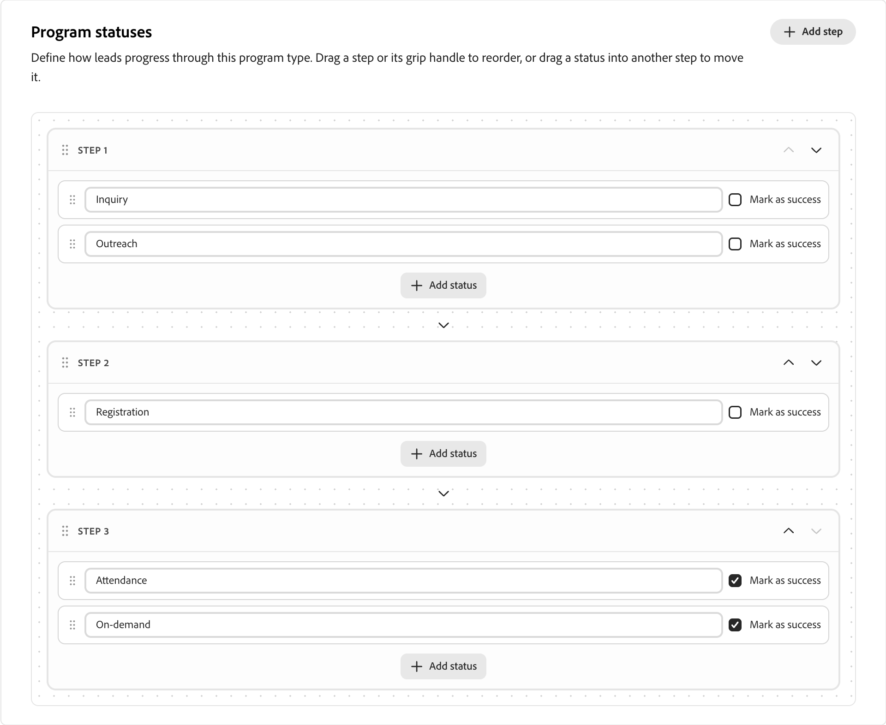

# Programmtypen

Programmtypen definieren wichtige Aspekte von [Programmen](../marketing/programs.md) und deren Mitgliedern und unterscheiden verschiedene Arten von Marketing-Programmen voneinander. Jeder Programmtyp definiert die folgenden Eigenschaften, die für Programme mithilfe des Programmtyps übernommen werden:

* **Attribute** - Die Attribute beschreiben die wichtigen Aspekte des Programmtyps, wie Ereignisdaten und Standortattribute.

* **Programmstatusfluss** - Jeder Status wird einem Schritt im Programmtyp zugewiesen (z. B. 1, 2 oder 3). Mitglieder eines Programms können nur von einem Status mit derselben Schrittnummer (z. B. von _Nicht angezeigt_ zu _Teilgenommen_) oder zu einem Status mit einer höheren Schrittnummer (z. B. von _Eingeladen_ zu _Registriert_) wechseln.

  Programmstatus schließen sich gegenseitig aus und sind linear, sodass eine Person nur einen Statuswert pro Programm haben kann. Überlegen Sie beim Entwerfen von Status, zwischen welchen Status Sie wechseln möchten. Wenn beispielsweise jemand nicht zu einem Webinar erschienen ist, aber die Möglichkeit hat, später bei Bedarf teilzunehmen, sollte er entweder dieselbe Statusnummer erhalten oder bei Bedarf eine höhere Statusnummer erhalten, damit ein Programmmitglied zu dieser wechseln kann.

>[!NOTE]
>
>Wenn ein Programmtyp von mindestens einem Programm verwendet wird, kann er nicht bearbeitet werden.

_So definieren Sie einen benutzerdefinierten Programmtyp :_

1. Erweitern Sie in der linken [!DNL Adobe Marketo Optimizer]-Navigation **[!UICONTROL Administration]** und wählen Sie **[!UICONTROL Programmtypen]**.

   {width="800" zoomable="yes"}

1. Klicken **[!UICONTROL oben]** auf „Typ erstellen“.

1. Geben Sie einen eindeutigen **[!UICONTROL Name]** (erforderlich) und **[!UICONTROL Beschreibung]** (optional) ein.

   {width="600" zoomable="yes"}

   >[!TIP]
   >
   >Das Einschließen einer Beschreibung ist eine Best Practice und macht Ihre Programmtypbibliothek leichter zu verwalten.

1. Klicken Sie **[!UICONTROL Typ erstellen]**.

1. Fügen Sie **[!UICONTROL Programmtyp]** Attribute“ hinzu.

   Für jedes Attribut, das Sie hinzufügen möchten:

   * Klicken Sie **[!UICONTROL Attribut hinzufügen]**.
   * Wählen Sie den **[!UICONTROL API-]** aus und geben Sie den **[!UICONTROL Anzeigenamen]** ein.
   * Klicken Sie auf **[!UICONTROL Speichern]**.

   {width="600" zoomable="yes"}

1. Definieren Sie die Schritte für **[!UICONTROL Programmstatus]**.

   Definieren Sie jeden Schritt, den Sie in den Fluss aufnehmen möchten:

   * Klicken Sie **[!UICONTROL Schritt hinzufügen]**.
   * Geben Sie einen Statusnamen ein.
   * (Optional) Klicken Sie **[!UICONTROL Status hinzufügen]** und geben Sie einen zusätzlichen Statusnamen ein, der in den Schritt aufgenommen werden soll.

   Aktivieren Sie das **[!UICONTROL Als Erfolg]** markieren) für jeden Schritt, den Sie als erfolgreiche Programmausführung verfolgen möchten.

   {width="600" zoomable="yes"}

1. Klicken Sie **[!UICONTROL Fertig]**, um Ihre Änderungen zu speichern und zur Liste Programmtypen zurückzukehren.