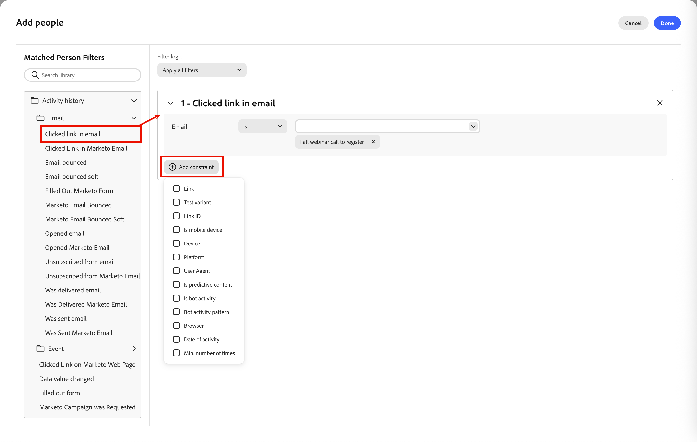

# Personenlisten

In [!DNL Adobe Marketo Optimizer] sind Personenlisten die Container auf Personenebene für Targeting und Personen-Journey-Einträge mit dynamischen Listen für die regelbasierte Live-Qualifizierung und statischen Listen für feste oder Journey-verwaltete Mitgliedschaften.

## Aufrufen und Durchsuchen von Personenlisten {#access-browse}

1. Erweitern Sie in der linken Navigation **[!UICONTROL Marketing-Verwaltung]**.

1. Wählen Sie rechts in der **[!UICONTROL Marketing]**-Ressourcenliste **[!UICONTROL Personenlisten]** aus.

   {width="800" zoomable="yes"}

Es gibt zwei Registerkarten für die Seite, auf denen Sie „Dynamische Listen **[!UICONTROL und „Statische Listen]** anzeigen **[!UICONTROL verwalten]**. Klicken Sie auf die Registerkarte, um die Listenansicht zwischen den beiden Typen zu wechseln.

Um die angezeigte Liste nach Namen zu filtern _können Sie oben in der Liste_ Text in das Tool „Suchen“ eingeben. Verwenden Sie die Listen-Tools, um die angezeigte Liste anzupassen:

* Klicken Sie auf _Tabelle anpassen_ (  ), um die angezeigten Spalten zu steuern.
* Klicken Sie auf _Symbol „Spalten zurücksetzen_ (  ), um die Spaltenbreiten zurückzusetzen.

Von diesem Bereich aus können Sie auch:

* Erstellen neuer dynamischer und statischer Listen
* Auf Listen zugreifen, um die aktuelle Mitgliedschaft zu überprüfen
* Anwenden von Mitgliedschaftsfiltern

<!--
## Audience Hub

The AI Audience Hub is a centralized, AI-driven starting point for all audience-related capabilities across [!DNL Adobe Marketo Optimizer]. It is designed to accelerate first-time user success while progressively unlocking advanced intelligence, insights, and control for returning and power users.

The Hub acts as:

* A guided starting point for discovering, creating, and refining person lists, account lists, and buying groups

* A visibility layer for audience health, coverage, overlap, engagement patterns, and AI-driven insights

* A control center for audience governance, optimization, reuse, and readiness for activation across journeys and sales workflows

### High level structure

Prompt-based starting point - Quick Start prompts and freeform input to help users discover, create, or optimize audiences.

1. AI insights feed - Surfaces key audience signals such as overlap, gaps, saturation risk, and optimization opportunities.

1. Adaptive audience library - A personalized view of people lists, account lists, and buying groups that adapts based on usage, relevance, and activation.

1. Optimization and arbitration nudges - Guides users to refine, split, or reuse audiences before activation.

1. Audience visibility and reporting - High-level insight into audience health, engagement patterns, and usage across active journeys.

### Empty and Error States (High-Level)

No audiences / no data - Show Quick Start prompts to help first-time users create or import person lists

Low data or incomplete audience - Explain what's missing (e.g., insufficient contacts, missing persona coverage, or low engagement data) and suggest next steps.

AI insights unavailable - Provide a graceful fallback with a clear explanation, so users understand why insights aren't shown and what actions they can take manually.
-->

## Erstellen einer Personenliste {#create-people-list}

1. Klicken **[!UICONTROL oben rechts]** der Seite &quot;_[!UICONTROL &quot; auf „Liste]_&quot;.

1. Wählen Sie im Dialogfeld ein Programm als **[!UICONTROL Übergeordnetes Element]** für die Liste aus.

1. Geben Sie **[!UICONTROL (Name]** (erforderlich) und **[!UICONTROL Beschreibung]** (optional) für die Liste ein.

1. Wählen Sie die Liste **[!UICONTROL Typ]**:

   * [**[!UICONTROL Statisch]**](#static-lists) - Die Mitgliedschaft wird durch qualifizierte Filter bestimmt, die beim Erstellen der Liste ausgewertet werden. Die Listenmitgliedschaft wird nur aktualisiert, wenn Datensätze manuell qualifiziert oder disqualifiziert werden.
   * [**[!UICONTROL Dynamisch]**](#dynamic-lists) - Die Mitgliedschaft wird durch qualifizierte Filter dynamisch bestimmt. Die Mitgliedschaft in der Liste wird automatisch aktualisiert.

   {width="450"}

1. Klicken Sie auf **[!UICONTROL Erstellen]**.

>[!NOTE]
>
>„Löschen“ und „Duplizieren“ werden derzeit für Personenlisten in dieser Beta-Version nicht unterstützt.

## Statische Listen {#static-lists}

Die statische Mitgliedschaft in Listen wird durch einfache Filter definiert, die auf Personenattribute und Aktivitäten verweisen. Die Mitgliedschaft ändert sich nur, wenn Sie Mitglieder manuell qualifizieren oder disqualifizieren.

>[!NOTE]
>
>Statische Listenfilterdefinitionen werden nur einmal angewendet, wenn Sie Mitglieder zur Liste hinzufügen oder daraus entfernen. Der definierte Filter ist danach nicht mehr verfügbar. Wenn Sie eine konsistente Zielgruppendefinition mithilfe von Filtern beibehalten möchten, verwenden Sie stattdessen eine dynamische Liste.

<!--
What internet says about Marketo static lists -- which of these is also true in Marketo Optimizer?

* Manual Targeting: Storing fixed cohorts, such as attendees of a specific webinar, people who purchased a certain product, or a list of competitors.
* Third-Party Syncing: Allowing external platforms (like Amplitude or Twilio Segment) to automatically sync and export groups of users directly into Marketo as targeted audiences.
* Status Tracking: Helping marketers organize leads into specific categories or track multi-value interests without needing to create new, permanent database fields.List 
* Segmentation: Acting as a reliable, unchanging recipient or suppression list for email campaigns and engagement programs. Unlike a Smart List—which dynamically adds or removes people based on changing criteria or rules—a static list serves as a reliable snapshot. People remain on the list until explicitly added or removed by you or a backend flow.

So far, activating to a destination is the only thing that they are used for that I have found.
-->

### Mitglieder hinzufügen {#static-list-add-members}

1. Öffnen Sie die statische Liste und klicken Sie **[!UICONTROL oben]** auf „Personen hinzufügen“.

1. Definieren Sie im Dialogfeld die Regeln für die Qualifizierung Ihrer Leads, indem Sie Filter von links ziehen und ablegen.

   Sie können Personen nach einer beliebigen Kombination aus folgenden Kriterien filtern:

   * Aktivitätsverlauf
   * Unternehmensattribute
   * Personenattribute
   * Spezielle Filter wie Journey-Mitgliedschaft

   Klicken Sie für jeden hinzugefügten Filter auf **[!UICONTROL Beschränkungen hinzufügen]**, um die entsprechenden Kriterien für den Filter zu verfeinern.

   {width="700" zoomable="yes"}

1. Klicken Sie auf „Fertig“, um **[!UICONTROL Änderungen]** speichern.

1. Wählen Sie die **[!UICONTROL Mitglieder]** aus.

   Nach kurzer Zeit werden qualifizierte Mitglieder in der Liste aufgeführt.

   {width="700" zoomable="yes"}

### Mitglieder entfernen {#static-list-remove-members}

1. Öffnen Sie die statische Liste und klicken Sie **[!UICONTROL oben]** auf „Personen entfernen“.

1. Fügen Sie im _[!UICONTROL Personen entfernen]_ die Filter hinzu, um Mitglieder zuzuordnen, die Sie disqualifizieren möchten.

   {width="700" zoomable="yes"}

1. Klicken Sie auf „Fertig“, um **[!UICONTROL Änderungen]** speichern.

1. Wählen Sie die **[!UICONTROL Mitglieder]** aus.

   Nach kurzer Zeit verlassen die disqualifizierten Mitglieder die Liste.

### Für ein Ziel aktivieren {#static-list-activate}

Wenn Sie eine statische Liste aktivieren, kann sie in nachgelagerten Systemen verarbeitet werden, wobei die Synchronisierung anstelle manueller Exporte fortgesetzt wird. Dies ist für Paid-Media-Targeting, Unterdrückung und nachgelagerte Orchestrierung nützlich.

* Die statische Liste dient als Container für die Personen.
* Die Aktivierung sendet/synchronisiert diese Mitgliedschaft an ein Ziel.
* Das Ziel kann dann etwas mit diesen Personen anfangen, z. B. sie auf LinkedIn ansprechen oder sie aus einer externen Zielgruppe entfernen.

Da das Aktivierungsmodell persistent sein soll, d. h. kein einmaliger Export:

* Personen, die der Liste später hinzugefügt werden, werden automatisch weitergegeben.
* Später entfernte Personen werden automatisch deaktiviert.
* Marketing-Experten vermeiden wiederholte CSV-Exporte und manuelle Uploads.
* Journeys können die Zielgruppe im Laufe der Zeit aktualisieren, um eine fortlaufende Orchestrierung sicherzustellen.

>[!PREREQUISITES]
>
>Sie müssen mindestens ein [konfiguriertes Ziel](./destinations.md) für Ihre [!DNL Marketo Optimizer]-Sandbox haben, bevor Sie eine statische Liste für ein Ziel aktivieren können.

1. Wählen Sie die **[!UICONTROL Statische Listen]** aus.

1. Suchen Sie die statische Liste, die Sie für ein Ziel aktivieren möchten.

1. Klicken Sie auf das Symbol _Mehr_ ( **…** ) neben der Liste und wählen Sie **[!UICONTROL Für Ziel aktivieren]**.

   {width="450"}

   Sie können auch die statische Liste öffnen und das Menü _[!UICONTROL Mehr]_ oben rechts verwenden.

   <!-- which UI is it?  _Activate_ (  ) icon next to the static list name. -->

1. Aktivieren Sie das Kontrollkästchen für die konfigurierte Zielverbindung.

   {width="600" zoomable="yes"}

1. Klicken Sie auf **[!UICONTROL Speichern]**.

1. Bestätigen Sie die Aktivierung im Dialogfeld _[!UICONTROL Liste für Ziel aktivieren]_ durch Klicken auf **[!UICONTROL Aktivieren]**.

Nach Abschluss der Aktivierung wird eine Bestätigung angezeigt _Das Ziel wurde aktiviert._) und das Ziel als **[!UICONTROL Aktiv]** auf der Registerkarte **[!UICONTROL Ziele]** der Liste aufgeführt ist. Eine statische Liste kann für mehr als ein Ziel gleichzeitig aktiviert werden. Die Mitgliedschaft synchronisiert alle Ziele.

Um die Ziele zu überprüfen, für die eine statische Liste aktiviert ist, öffnen Sie die Liste und wählen Sie die Registerkarte **[!UICONTROL Ziele]** aus. Standardmäßig sind für eine neue Liste keine Ziele verbunden.

#### Deaktivieren eines Ziels {#deactivate-destination}

1. Öffnen Sie die statische Liste und wählen Sie die Registerkarte **[!UICONTROL Ziele]** aus.

1. Klicken Sie auf _Minus_-Symbol ( **-** ) in der Zeile des Ziels, das Sie entfernen möchten.

1. Bestätigen Sie dies im _[!UICONTROL Ziel deaktivieren]_.

Durch Deaktivieren wird das Ziel aus der Liste entfernt. Die Personen in der Liste werden auch aus der verbundenen Zielgruppe entfernt.

## Dynamische Listen {#dynamic-lists}

Die Zugehörigkeit zu einer dynamischen Liste wird mithilfe einfacher Filter definiert, die auf Personenattribute und Aktivitäten verweisen. Die Mitgliedschaft wird automatisch aufrechterhalten, indem Leads entsprechend der Filterlogik qualifiziert und disqualifiziert werden.

### Festlegen von Mitgliedschaftsregeln {#set-membership-rules}

1. Öffnen Sie die dynamische Liste und wählen Sie die Registerkarte **[!UICONTROL Regeln]** aus.

1. Klicken Sie auf **[!UICONTROL Regeln bearbeiten]**.

   {width="550" zoomable="yes"}

1. Definieren Sie im Dialogfeld die Regeln für die Qualifizierung Ihrer Leads, indem Sie Filter von links ziehen und ablegen.

   Sie können Leads für die Liste qualifizieren, indem Sie eine beliebige Kombination aus Folgendem verwenden:

   * Aktivitätsverlauf
   * Unternehmensattribute
   * Personenattribute
   * Spezielle Filter wie Journey-Mitgliedschaft

   Klicken Sie für jeden hinzugefügten Filter auf **[!UICONTROL Beschränkungen hinzufügen]**, um die entsprechenden Kriterien für den Filter zu verfeinern.

   {width="700" zoomable="yes"}

1. Klicken Sie auf „Fertig“, um **[!UICONTROL Änderungen]** speichern.

1. Wählen Sie die **[!UICONTROL Mitglieder]** aus.

   Nach kurzer Zeit werden qualifizierte Mitglieder in der Liste aufgeführt.

   {width="700" zoomable="yes"}

   Um die Seite [Personendetails“ zu öffnen](./person-details.md) auf der Sie die Zusammenfassung und die letzten Aktivitäten anzeigen können, klicken Sie auf den Namen einer Person in der Liste.

### Dynamische Liste duplizieren {#duplicate-dynamic-list}

Bei einer dynamischen Liste ähnelt eine doppelte Aktion einer Klonfunktion. Verwenden Sie diese Funktion, um die Mitgliedschaftsfilterung zu replizieren und sie einem anderen Programm hinzuzufügen.

1. Klicken Sie auf _[!UICONTROL Registerkarte]_ Dynamische Listen“ auf das Symbol _Mehr_ ( **…** ) neben der Liste und wählen Sie **[!UICONTROL Duplizieren]**.

1. Wählen Sie im Dialogfeld das **[!UICONTROL Übergeordnet]**-Programm für die duplizierte Liste aus.

1. Geben Sie einen eindeutigen **[!UICONTROL Name]** (erforderlich) und **[!UICONTROL Beschreibung]** (optional) ein.

   Standardmäßig verwendet das Dialogfeld den Namen der Ursprungsliste, die an `_copy` angehängt wird. Geben Sie bei Bedarf einen anderen eindeutigen Namen für die Liste ein.

   {width="375"}

1. Klicken Sie auf **[!UICONTROL Duplizieren]**.
