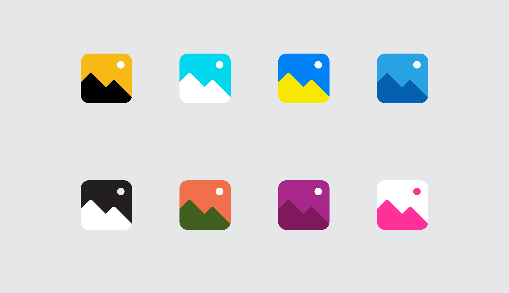
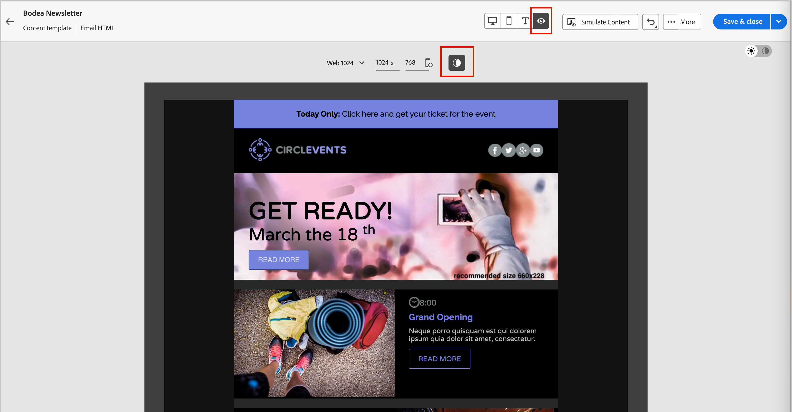

# Dunkler Modus für E-Mail-Content {#dark-mode}

>[!CONTEXTUALHELP]
>id="ajo-b2b_dark_mode"
>title="Wechseln zum dunklen Modus"
>abstract="Wechseln Sie in den dunklen Modus, um das Rendering in der Vorschau anzuzeigen und benutzerdefinierte Einstellungen zu definieren.  Das Rendering hängt vom E-Mail-Client der Empfängerinnen und Empfänger ab. Nicht alle E-Mail-Clients unterstützen den benutzerdefinierten dunklen Modus."

>[!CONTEXTUALHELP]
>id="ajo-b2b_dark_mode_preview"
>title="Wechseln zum dunklen Modus"
>abstract="Wechseln Sie zum dunklen Modus, um eine Vorschau des Renderings in unterstützenden E-Mail-Clients anzuzeigen.  Das endgültige Rendering hängt vom E-Mail-Client der Empfängerinnen und Empfänger ab. Beachten Sie, dass nicht alle E-Mail-Clients den dunklen Modus unterstützen."

_Dunkler Modus_ ermöglicht es einem unterstützenden E-Mail-Client oder einer unterstützenden App, E-Mails mit dunkleren Hintergründen und helleren Farben für Text, Schaltflächen und andere visuelle Elemente anzuzeigen. Diese Art von Display reduziert die Belastung der Augen, spart Akkulaufzeit und verbessert die Lesbarkeit in schwach beleuchteten Umgebungen für ein angenehmeres Betrachtungserlebnis. Aufgrund des wachsenden Trends bei den wichtigsten Betriebssystemen und Apps ist es jetzt eine wichtige Überlegung im modernen E-Mail-Design, sicherzustellen, dass Inhalte für alle Benutzer lesbar und visuell ansprechend bleiben.

Wenn Sie [E-Mail](./email-authoring.md)Inhalt erstellen) im visuellen [!DNL Marketo Optimizer]-Design-Bereich wechseln Sie zur Ansicht _&#x200B;**[!UICONTROL Dunkelmodus]**&#x200B;_. In dieser Ansicht können Sie auch spezifische benutzerdefinierte Einstellungen für unterstützende E-Mail-Clients definieren, wenn deren Dunkelmodus aktiviert ist.

## Überlegungen zum E-Mail-Client {#email-client-considerations}

Die Art und Weise, wie verschiedene E-Mail-Clients und Apps den Dunkelmodus anwenden, ist sehr unterschiedlich. Beachten Sie daher die Erwartungen an das Rendering im Dunkelmodus mit Vorsicht. Bevor Sie den Dunkelmodus im E-Mail-Design-Bereich verwenden, sollten Sie die folgenden Anwendungsfälle für E-Mail-Clients berücksichtigen:

+++Clients, die den Dunkelmodus nicht unterstützen

Einige E-Mail-Clients unterstützen diese Funktion überhaupt nicht, z. B.:

* [!DNL Yahoo! Mail]
* [!DNL AOL]

Wenn Sie benutzerdefinierte Einstellungen für den Dunkelmodus im E-Mail-Design definieren, können diese E-Mail-Clients keinen Dark-Mode-Rendering anzeigen.

+++

+++Clients, die ihren eigenen dunklen Modus anwenden

Einige E-Mail-Clients wenden ihren eigenen standardmäßigen Dunkelmodus systematisch auf alle empfangenen E-Mails an. Sie passen Farben, Hintergründe, Bilder und andere Elemente automatisch an die Einstellungen im Dunkelmodus an, und externe Einstellungen sind nicht möglich. Zu diesen Clients gehören:

* Gmail (Desktop-Webmail, iOS, Android™, mobile Webmail)
* Outlook Windows
* Outlook Windows Mail

In diesem Fall überschreiben die Client-Einstellungen für den Dunkelmodus die benutzerdefinierten Einstellungen für den Dunkelmodus, die Sie in [!DNL Marketo Optimizer] definieren.

+++

+++Clients, die den benutzerdefinierten Dunkelmodus unterstützen

Viele der beliebtesten E-Mail-Clients unterstützen das benutzerdefinierte Dark-Mode-Rendering mit der `@media (prefers-color-scheme: dark)`-Abfrage, bei der es sich um die von den [!DNL Marketo Optimizer] E-Mail-Stilen verwendete Methode handelt. Diese Kundenliste umfasst:

* Apple Mail für macOS
* Apple Mail für iOS
* Outlook macOS
* Outlook.com
* Outlook iOS
* Outlook Android™

In diesem Fall werden die spezifischen Einstellungen, die Sie in [!DNL Marketo Optimizer] definieren, gerendert. Je nach E-Mail-Client können jedoch einige Einschränkungen gelten. Einige Clients (z. B. Apple Mail 16 (macOS 13)) generieren beispielsweise keinen Dunkelmodus, wenn im E-Mail-Inhalt Bilder vorhanden sind.

Um optimale Ergebnisse zu erzielen, testen Sie Ihren Inhalt mit den E-Mail-Clients, auf die Sie abzielen.

+++

## Design für den Dunkelmodus

Der [!DNL Marketo Optimizer] visuelle Design-Bereich bietet zwei Arten von Tools zum Formatieren von E-Mail-Inhalten im Dunkelmodus:

* Verwenden Sie die [Vorschaufunktion](#preview-dark-mode), um das standardmäßige Dark-Mode-Rendering für die meisten unterstützenden E-Mail-Clients zu überprüfen.

* Wenn Sie die Standardeinstellungen unterstützender E-Mail-Clients überschreiben möchten, definieren und wenden Sie [benutzerdefinierte Einstellungen für den Dunkelmodus](#custom-dark-mode) auf Ihren E-Mail-Inhalt an.

### Anzeigen des standardmäßigen dunklen Modus in der Vorschau {#preview-dark-mode}

1. Öffnen Sie den E-Mail-Inhalt im E-Mail-Design-Bereich.

   Oben rechts auf der Arbeitsfläche gibt es einen Hell-Dunkel-Selektor, der die Inhaltsanzeige zwischen Hell- (Standard) und Dunkelmodus umschaltet.

   {width="700" zoomable="yes"}

1. Ändern Sie den Selektor in _Dunkelmodus_ (  ).

   Auf der Arbeitsfläche wird der Inhalt mit der standardmäßigen Vorschau des dunklen Modus angezeigt.

   Standardmäßig wendet die Dunkelmodusvorschau das `full color invert` Farbschema auf alle Elemente außer Bildern und Symbolen an. Dieses Farbschema erkennt Bereiche mit hellen und dunklen Elementen und invertiert sie. Helle Hintergründe werden dunkel und dunkler Text wird hell, oder dunkle Hintergründe werden hell und heller Text wird dunkel.

   {width="700" zoomable="yes"}

>[!CAUTION]
>
>Das endgültige Rendering kann je nach E-Mail-Client des Empfängers variieren. Um eine Simulation anzuzeigen, die dem Endergebnis für jeden E-Mail-Client so nahe kommt wie möglich, verwenden Sie die Litmus-E-Mail-Rendering-Integration, die über **[!UICONTROL Inhalt simulieren]** im E-Mail-Design-Bereich verfügbar ist.

### Festlegen der benutzerdefinierten Einstellungen für den dunklen Modus {#custom-dark-mode}

>[!CONTEXTUALHELP]
>id="ajo-b2b_dark_mode_image"
>title="Verwenden eines bestimmten Bildes für den dunklen Modus"
>abstract="Wählen Sie ein anderes Bild für den dunklen Modus aus.  Das Hinzufügen eines bestimmten Bilds garantiert nicht, dass es in allen E-Mail-Clients ordnungsgemäß gerendert wird. Nicht alle E-Mail-Clients unterstützen den benutzerdefinierten dunklen Modus."

Nach dem Wechsel in den Dunkelmodus können Sie bestimmte Stilelemente Ihres Inhalts bearbeiten, die nur angezeigt werden, wenn der Dunkelmodus im E-Mail-Client des Empfängers aktiviert ist (sofern er diese Funktion unterstützt).

>[!NOTE]
>
>Das endgültige Rendering im dunklen Modus hängt vom individuellen E-Mail-Client ab, die Ergebnisse können daher variieren. Weitere Informationen finden Sie unter [Überlegungen zum E](#email-client-considerations)Mail-Client“.

Der benutzerdefinierte Dunkelmodus-Stil verwendet die `@media (prefers-color-scheme: dark)` CSS-Abfrage, um zu erkennen, ob der E-Mail-Client auf den Dunkelmodus eingestellt ist, und um Ihr definiertes Dunkelmotiv-Design anzuwenden.

_So definieren Sie benutzerdefinierte Einstellungen für den Dunkelmodus :_

1. Verschieben Sie bei Bedarf die Auswahl in _Dunkelmodus_ (  ) oben rechts auf der Design-Arbeitsfläche.

1. Bearbeiten Sie alle Stilattribute wie Text, Hintergrund oder Schaltflächen.

{width="700" zoomable="yes"}

1. Definieren Sie für Bilder und Symbole bestimmte Assets nur für den Dunkelmodus.

   Sie können die Farben von Bildern und Symbolen nicht ändern, aber Sie können alternative Assets definieren, die für den Dunkelmodus verwendet werden sollen. Sie können mit verschiedenen Farbkombinationen für Ihre Symbole experimentieren oder Anpassungen für Farbe und Sättigung für fotografische Bilder vornehmen.

   {width="80%"}

   Wählen Sie ein beliebiges Bild aus und wechseln Sie **[!UICONTROL Dunkelmodus]** mithilfe des entsprechenden Umschalters im Bereich **[!UICONTROL Einstellungen]**. Wählen Sie dann in der Asset-Auswahl von Marketo Design Studio ein anderes Bild-Asset aus.

   Weitere [&#x200B; zur Auswahl eines Bild-Assets finden Sie &#x200B;](./email-authoring.md#insert-image) „Einfügen eines Bildes aus Marketo Design Studio“.

1. Wählen Sie zu einem beliebigen Zeitpunkt während der Designänderungen **[!UICONTROL Zur Live-Ansicht wechseln]**, um zu überprüfen, wie Ihre Inhalte möglicherweise auf verschiedenen Gerätegrößen gerendert werden.

   Ändern Sie in dieser Ansicht den Selektor in _Dunkelmodus_ (  ), um eine Vorschau der Dunkelmodusversion Ihres Inhalts auf verschiedenen Geräten anzuzeigen.

   {width="800" zoomable="yes"}

   >[!CAUTION]
   >
   >Die Live-Ansicht ist eine allgemeine Vorschau, die vergleicht, wie das Rendering über verschiedene Gerätegrößen hinweg aussehen könnte. Das endgültige Rendering kann je nach E-Mail-Client des Empfängers variieren.

1. Wenn die Änderungen am Dunkelmodus abgeschlossen sind, klicken Sie auf **[!UICONTROL Inhalt simulieren]**, um die Vorschau- und Proofing-Tools zum Testen Ihres E-Mail-Designs zu verwenden.

1. Wenn Sie über ein Litmus Enterprise-Konto verfügen, wählen Sie **[!UICONTROL E-Mail rendern]**, um das endgültige Dark-Mode-Rendering für verschiedene E-Mail-Clients in der Litmus-Integration anzuzeigen.

   >[!CAUTION]
   >
   >Während die Simulation der Darstellung von E-Mails im Dunkelmodus sehr nahe kommt, kann das tatsächliche Rendering aufgrund von Variationen bei E-Mail-Dienstanbietern oder Einstellungen auf Geräteebene unterschiedlich sein.

## Best Practices {#best-practices}

Da die Akzeptanz des Dunkelmodus in den wichtigsten E-Mail-Clients zunimmt, ist es wichtig zu berücksichtigen, wie Ihre E-Mails in hellen und dunklen Umgebungen gerendert werden - unabhängig davon, ob Sie [benutzerdefinierten Dunkelmodus](#custom-dark-mode) verwenden oder nicht.

Der dunkle Modus kann Farben, Hintergründe und Bilder verändern – und manchmal bestimmte Design-Entscheidungen überschreiben. Befolgen Sie die folgenden Best Practices, um visuelle Konsistenz, Barrierefreiheit und Markenintegrität sicherzustellen:

| Übung |            |
| -------- | ---------- |
| Optimieren von Bildern und Logos | Checkliste:<ul><li>Speichern Sie Logos und Symbole als PNG-Dateien mit transparentem Hintergrund, um sichtbare weiße Kästchen im Dunkelmodus zu vermeiden. <li>Vermeiden Sie Bilder mit hartcodierten weißen oder hellen Hintergründen. <li>Wenn Transparenz nicht möglich ist, platzieren Sie Bilder in Ihrem Design auf einem einfarbigen Hintergrund, um unangenehme Farbinversionen zu verhindern. |
| Ihre Hintergründe ansehen | Checkliste:<ul><li>Stellen Sie einen ausreichenden Kontrast zwischen Text- und Hintergrundfarben sicher, damit die Lesbarkeit sowohl im hellen als auch im dunklen Modus gewahrt bleibt. <li>Vermeiden Sie es, sich bei kritischem Content allein auf Hintergrundfarben zu verlassen. Einige Clients überschreiben Hintergrundfarben im Dunkelmodus, sodass wichtige Informationen weiterhin sichtbar sind. |
| Entwerfen barrierefreier Inhalte im Dunkelmodus | Checkliste:<ul><li>Verwenden Sie Farbkombinationen, die für Menschen mit Farbenblindheit leicht zu unterscheiden sind. <li>Verwenden Sie eine Mitteltonpalette, um sowohl vor hellen als auch vor dunklen Hintergründen einen Kontrast sicherzustellen. <li>Verwenden Sie barrierefreie Farbkombinationen mit hohem Kontrast, um die Lesbarkeit zu verbessern und [!DNL Web Content Accessibility Guidelines (WCAG)] Standards zu erfüllen. Verwenden Sie Tools wie [!DNL WebAIM Contrast Checker], um den Farbkontrast zu überprüfen. <li>Vermeiden Sie dünne Schriftarten, da sie die Lesbarkeit beeinträchtigen können. Wenn für Ihre Marke eine dünne Schriftart erforderlich ist, verwenden Sie im dunklen Modus eine fette Variante. <li>Überspringen Sie reines Weiß auf reinem Schwarz, was zu Augenbelastungen führen kann und in einigen E-Mail-Clients automatisch invertiert werden könnte. <li>Stellen Sie barrierefreie Fallback-Stile bereit, wenn der dunkle Modus nicht unterstützt wird. |
| Testen von E-Mails in einer Umgebung mit dunklem Modus | Checkliste:<ul><li>Verwenden Sie die [Dunkelmodusvorschau](#preview-dark-mode) im E-Mail-Design-Bereich, der invertierte Farbschemata verwendet, um Probleme frühzeitig zu erkennen. <li>Wenn Sie über ein Litmus Enterprise-Konto verfügen, verwenden Sie die Option **[!UICONTROL E-Mail rendern]**, um Ihre Designs auf wichtigen E-Mail-Clients (wie Apple Mail, Gmail und Outlook) zu simulieren und zu sehen, wie sich Farben und Bilder im Dunkelmodus verhalten. |

