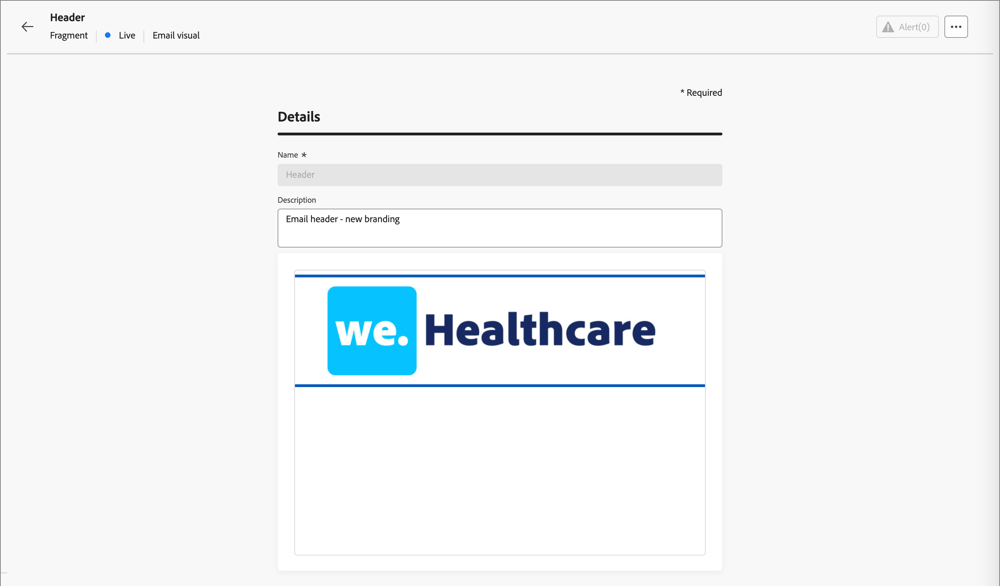

# Fragmente

Ein Fragment ist eine wiederverwendbare Komponente, die in einer oder mehreren E-Mails und E-Mail-Vorlagen [!DNL Marketo Optimizer] referenziert werden kann. Normalerweise handelt es sich dabei um einen Inhaltsblock (Text, Bild oder beides), der vorab erstellt und schnell in eine E-Mail- oder E-Mail-Vorlage eingefügt werden kann. Mit dieser Funktion können Sie mehrere benutzerdefinierte Inhaltsbausteine vorab erstellen, die von Ihren Mitgliedern des Marketing-Teams verwendet werden können, um E-Mail-Inhalte für einen verbesserten Design-Prozess zusammenzustellen. Häufige Anwendungsfälle sind Kopf-/Fußzeilen-Inhaltsbausteine für E-Mails, Einladungsbanner für Veranstaltungen und saisonale Grußformeln.

>[!BEGINSHADEBOX]

**Visuelle Fragmente**

Visuelle Fragmente sind vordefinierte visuelle Bausteine, die mithilfe von visuellen Design-Tools erstellt wurden und die Sie in mehreren E-Mails oder E-Mail-Vorlagen wiederverwenden können. Der aktuelle Umfang der [!DNL Marketo Optimizer] und diese Dokumentation umfassen nur visuelle Fragmente.

>[!NOTE]
>
>Ausdrucksbasierte Fragmente werden in [!DNL Marketo Optimizer] noch nicht unterstützt.

>[!ENDSHADEBOX]

So verwenden Sie Fragmente in Ihren Workflows optimal:

* _Eigene Fragmente erstellen_ - Erstellen Sie visuelle Fragmente, entweder von Grund auf neu oder indem Sie Inhalte als Fragment aus dem visuellen Inhaltsdesign-Bereich speichern.
* _Fragmente wiederverwenden_ - Verwenden Sie sie so oft wie nötig in Ihrem E-Mail- oder E-Mail-Vorlageninhalt.

## Aufrufen und Verwalten von Fragmenten {#access-manage-fragments}

Um auf visuelle Fragmente in [!DNL Marketo Optimizer] zuzugreifen, navigieren Sie zur linken Navigationsleiste und erweitern Sie **[!UICONTROL Content-Management]**. Wählen Sie dann **[!UICONTROL Fragmente]**. Diese Aktion öffnet eine Listenseite mit allen in der Instanz erstellten Fragmenten, die in einer Tabelle aufgeführt sind.

{width="700" zoomable="yes"}

Die Tabelle wird nach der Spalte _[!UICONTROL Geändert]_ sortiert, wobei die zuletzt aktualisierten Fragmente standardmäßig oben stehen. Klicken Sie auf den Spaltentitel, um zwischen aufsteigender und absteigender Reihenfolge zu wechseln.

Die Ordnerstruktur auf der linken Seite ermöglicht das Organisieren von Fragmenten. Standardmäßig werden alle Fragmente angezeigt. Wenn Sie einen Ordner auswählen, werden nur die Fragmente und Unterordner angezeigt, die im ausgewählten Ordner enthalten sind.

### Fragmentstatus {#fragment-status}

Der Fragmentstatus bestimmt seine Verfügbarkeit zur Verwendung in einer E-Mail oder E-Mail-Vorlage und die Änderungen, die Sie daran vornehmen können.

| Status | Beschreibung |
| ------ | ----------- |
| Entwurf | Wenn Sie ein Fragment erstellen, befindet es sich im Entwurfsstatus . Dieser Status bleibt erhalten, während Sie den visuellen Design-Bereich definieren oder bearbeiten, bis Sie ihn zur Verwendung in einer E-Mail oder E-Mail-Vorlage veröffentlichen. Verfügbare Aktionen: <ul><li>Alle Details bearbeiten<li>Bearbeiten im visuellen Design-Bereich<li>Veröffentlichen<li>Duplizieren<li>Löschen |
| Live | Wenn Sie ein Fragment veröffentlichen, wird es zur Verwendung in einer E-Mail oder E-Mail-Vorlage verfügbar. Veröffentlichte Fragmentinhalte können im visuellen Design nicht geändert werden. Verfügbare Aktionen: <ul><li>Beschreibung bearbeiten.<li>Hinzufügen zu einer E-Mail oder Vorlage<li>Versionsentwurf erstellen<li>Duplizieren<li>Löschen (wenn nicht in Gebrauch) |
| Live (mit Entwurf) | Wenn Sie einen Entwurf aus einem Live-Fragment erstellen, bleibt die Live-Version zur Verwendung in einer E-Mail- oder E-Mail-Vorlage verfügbar und der Entwurfsinhalt kann im visuellen Design-Bereich geändert werden. Wenn Sie die Entwurfsversion veröffentlichen, ersetzt sie die aktuelle Live-Version, und der Inhalt wird in den E-Mails und E-Mail-Vorlagen aktualisiert, in denen sie verwendet wird. Verfügbare Aktionen: <ul><li>Beschreibung bearbeiten.<li>Hinzufügen zu einer E-Mail oder Vorlage<li>Bearbeiten der Entwurfsversion im visuellen Design-Bereich<li>Entwurfsversion veröffentlichen<li>Duplizieren<li>Löschen (wenn nicht in Gebrauch) |
| Archiviert | Das Fragment wird archiviert und nicht in der Liste _Fragmente_ angezeigt. |

### Filtern der Fragmentliste {#filter-list}

Um nach einem Fragment anhand des Namens zu suchen, geben Sie eine Textzeichenfolge in die Suchleiste für eine Übereinstimmung ein. Wenn ein [Ordner](#folders) ausgewählt ist, gilt die Suche für alle Fragmente oder Ordner in der ersten Hierarchieebene dieses Ordners.

{width="500" zoomable="yes"}

Klicken Sie auf _Filter_-Symbol (  ), um die verfügbaren Filteroptionen anzuzeigen und die Einstellungen zu ändern, um die angezeigten Elemente entsprechend Ihren angegebenen Kriterien zu filtern.

### Spaltenanzeige anpassen {#column-display}

Passen Sie die Spalten an, die Sie in der Tabelle anzeigen möchten, indem Sie oben rechts auf _Tabelle anpassen_ („) klicken.

Wählen Sie im Dialogfeld die anzuzeigenden Spalten aus und klicken Sie auf **[!UICONTROL Anwenden]**.

{width="300"}

### Massenaktionen {#bulk-actions}

Sie können mehrere Fragmente mithilfe der Kontrollkästchen auswählen und Massenvorgänge auf alle anwenden. Die verfügbaren Aktionen werden in einer Massenaktionsleiste am unteren Rand der Listenseite angezeigt. Folgende Operationen sind verfügbar:

* **[!UICONTROL In Ordner verschieben]** - Verschiebt ausgewählte Fragmente in einen Ordner.
* **[!UICONTROL Archivieren]** - Archivieren ausgewählter Fragmente.

Sie können die Fragmentliste auch sortieren, indem Sie auf eine beliebige Spaltenüberschrift klicken, und die Spaltengröße ändern, indem Sie den Spaltenrahmen ziehen, um ihn an die benötigten Daten anzupassen.

## Erstellen von Fragmenten {#create-fragments}

Sie können neue visuelle Fragmente in [!DNL Marketo Optimizer] erstellen, indem Sie oben **[!UICONTROL auf „Fragment]**&quot; klicken.

1. Geben Sie auf _[!UICONTROL Seite]_ Fragment erstellen“ einen **[!UICONTROL (]**) und **[!UICONTROL Beschreibung]** (optional) ein.

   * Name - Maximal 100 Zeichen, muss eindeutig sein, Groß-/Kleinschreibung wird nicht beachtet

   * Beschreibung - Maximal 300 Zeichen

   * Alpha-, numerische und Sonderzeichen sind zulässig

   * Reservierte Zeichen sind **_nicht zulässig_**: `\ / : * ? " < > |`

   {width="700" zoomable="yes"}

1. Klicken Sie auf **[!UICONTROL Erstellen]**.

   Der visuelle Design-Bereich wird mit einer leeren Arbeitsfläche geöffnet.

1. Verwenden Sie die Inhaltserstellungs-Tools, um den visuellen Fragmentinhalt zu erstellen:

   * [Hinzufügen von Struktur und Content&#x200B;](./fragment-authoring.md#design-fragment)
   * [Hinzufügen von Assets](./fragment-authoring.md#add-assets)
   * [Navigieren in den Ebenen, Einstellungen und Stilen](./fragment-authoring.md#navigate-layers-settings-styles)
   * [Personalisieren von Inhalten](./fragment-authoring.md#personalize-content)
   * [Verknüpftes URL-Tracking bearbeiten](./fragment-authoring.md#edit-linked-url-tracking)

1. Klicken Sie **[!UICONTROL auf &quot;]**&quot;, um das Entwurfsfragment zu speichern.

1. Wenn Sie bereit sind, das Fragment für die Verwendung in einer E-Mail- oder E-Mail-Vorlage verfügbar zu machen, klicken Sie auf **[!UICONTROL Veröffentlichen]**.

## Anzeigen von Fragmentdetails {#view-details}

Klicken Sie auf den Namen eines beliebigen Fragments auf der Listenseite, um die Fragmentdetailseite zu öffnen. Sie können wählen, ob Sie das Fragment bearbeiten, das Fragment umbenennen oder die Fragmentbeschreibung aktualisieren möchten. Nehmen Sie Aktualisierungen vor und klicken Sie außerhalb des Namens- oder Beschreibungsfelds, um Änderungen automatisch zu speichern.

>[!NOTE]
>
>Wenn ein veröffentlichtes Fragment von einer E-Mail- oder E-Mail-Vorlage verwendet wird, können Sie den Namen nicht ändern oder den Inhalt bearbeiten. Sie können eine Entwurfsversion erstellen, wenn Sie Änderungen am Fragment vornehmen möchten.

{width="700" zoomable="yes"}

Klicken Sie **[!UICONTROL Fragment bearbeiten]**, um das Fragment im visuellen Inhaltseditor zu öffnen.

Sie können die Ansicht jederzeit verlassen, indem Sie oben links auf _Zurück_-Pfeil klicken, der Sie zur Listenseite _Fragmente_ zurückbringt.

## Anzeigen von Fragmentverweisen {#references}

Für ein _Live_-Fragment können Sie eine Liste der Assets anzeigen, die derzeit auf das Fragment verweisen (es verwenden).

1. Klicken Sie auf der Seite mit den Fragmentdetails auf Mehr (**…**) oben rechts.

1. Wählen Sie **[!UICONTROL Verweise erkunden]** aus.

   Auf _[!UICONTROL Seite „Fragmentverwendung]_ wird eine Liste der Assets angezeigt, in denen das Fragment derzeit innerhalb von [!DNL Marketo Optimizer] verwendet wird, und zwar über E-Mails und E-Mail-Vorlagen hinweg.

   >[!IMPORTANT]
   >
   >Fragment, das derzeit von einer E-Mail oder E-Mail-Vorlage verwendet wird, kann nicht gelöscht werden.

   Verweise werden nach Kategorie angezeigt: _E-_ oder _E-Mail-Vorlage_. Jede E-Mail in [!DNL Marketo Optimizer] wird in einem Aktionsknoten _E-Mail senden_ einer Personen-Journey definiert, sodass die übergeordnete Journey der E-Mail, die das Fragment verwendet, in Verweisen angezeigt wird.

1. Klicken Sie auf den Link, um die entsprechende E-Mail oder E-Mail-Vorlage zu öffnen, in der das Fragment verwendet wird.

## Verwenden von Ordnern zum Verwalten von Fragmenten {#folders}

Für eine einfache Fragmentnavigation können Sie Ordner verwenden, um sie effektiver in einer strukturierten Hierarchie zu organisieren. Auf diese Weise können Sie die Elemente entsprechend den Anforderungen Ihrer Organisation kategorisieren und verwalten.

Wählen Sie den _[!UICONTROL Stammordner]_ aus, um alle Fragmente anzuzeigen, einschließlich der Fragmente, die sich in allen Unterordnern befinden. Wählen Sie einen beliebigen Ordner in der Struktur aus, um dessen Inhalt anzuzeigen. Klicken Sie bei ausgewähltem Ordner auf Fragment erstellen , um ein neues Fragment in diesem Ordner zu erstellen.

### Ordner erstellen {#folders-create}

1. Klicken Sie bei ausgewähltem übergeordneten Ordner (Stamm oder ein anderer Ordner) oben **[!UICONTROL auf]** Ordner erstellen“.

1. Geben Sie **[!UICONTROL neuen Ordner einen]** Namen“ ein und klicken Sie auf **[!UICONTROL Speichern]**.

   Der neue Ordner wird oberhalb der Liste im ausgewählten übergeordneten Ordner angezeigt.

   Sie können auf das Symbol Mehr ( **…** ) klicken, um den Ordner umzubenennen, zu verschieben oder zu löschen.

### Ordner verschieben {#folders-move}

1. Klicken Sie auf das _Mehr_-Menü (**…**) Symbol neben dem Namen des Fragments, das Sie verschieben möchten.

1. Wählen Sie **[!UICONTROL In Ordner verschieben]**.

1. Navigieren Sie im Dialogfeld zur Ordnerstruktur und wählen Sie den Ordner aus, in den Sie das Fragment verschieben möchten.

1. Klicken Sie **[!UICONTROL Verschieben]**.

### Ordner löschen {#folders-delete}

1. Wählen Sie in der Ordnerstruktur das übergeordnete Element für den Ordner aus, den Sie löschen möchten.

1. Klicken Sie auf das _Mehr_-Menü (**…**) Symbol neben dem Namen des angezeigten Unterordners, den Sie löschen möchten.

1. Wählen Sie **[!UICONTROL Ordner löschen]**.

## Bearbeiten von Fragmenten {#edit-fragments}

Änderungen an einem Fragment hängen vom aktuellen Status ab:

* Wenn sich ein Fragment im _Entwurf_-Status befindet, können Sie alle zugehörigen Details und den visuellen Inhalt bearbeiten.
* Wenn sich ein Fragment im _Live_-Status befindet, können Sie die Fragmentbeschreibung bearbeiten, jedoch nicht den Namen. Visuelle Inhalte können nur bearbeitet werden, wenn ein Entwurf erstellt wurde.
* Wenn sich ein Fragment im _Live_-Status mit einem vorhandenen Entwurf befindet, ist die Bearbeitung der Details auf die Beschreibung beschränkt. Sie können auch den visuellen Inhalt für die Entwurfsversion bearbeiten.

>[!BEGINTABS]

>[!TAB Entwurf]

1. Klicken Sie auf _[!UICONTROL Listenseite]_ Fragmente“ auf den Fragmentnamen, um das Fragment zu öffnen.

   Eine Vorschau des visuellen Inhalts wird angezeigt.

1. Ändern Sie bei Bedarf die Beschreibung.

   {width="600" zoomable="yes"}

1. Um Änderungen am Inhalt im visuellen Design-Bereich vorzunehmen, klicken Sie **[!UICONTROL oben]** auf „Bearbeiten“.

   Verwenden Sie bei Bedarf visuelle Design-Tools:

   * [Hinzufügen von Struktur und Inhalten](./fragment-authoring.md#design-fragment)
   * [Hinzufügen von Assets](./fragment-authoring.md#add-assets)
   * [Navigieren in den Ebenen, Einstellungen und Stilen](./fragment-authoring.md#navigate-layers-settings-styles)
   * [Personalisieren von Inhalten](./fragment-authoring.md#personalize-content)
   * [Verknüpftes URL-Tracking bearbeiten](./fragment-authoring.md#edit-linked-url-tracking)

   Klicken Sie **[!UICONTROL Speichern]** oder **[!UICONTROL Speichern und schließen]** um zu den Fragmentdetails zurückzukehren.

1. Wenn das Fragment Ihren Kriterien entspricht und Sie es in einer E-Mail oder E-Mail-Vorlage verfügbar machen möchten, klicken Sie auf **[!UICONTROL Veröffentlichen]**.

>[!TAB Live]

1. Klicken Sie auf _[!UICONTROL Listenseite]_ Fragmente“ auf den Fragmentnamen, um das Fragment zu öffnen.

   Eine Vorschau des visuellen Inhalts wird mit den Fragmentdetails auf der rechten Seite angezeigt.

1. Ändern Sie bei Bedarf die Beschreibung.

1. Wenn Sie den Inhalt aktualisieren möchten, klicken Sie oben **[!UICONTROL auf]**&#x200B;Ändern“.

1. Klicken Sie im Dialogfeld auf **[!UICONTROL Bestätigen]**, um eine Entwurfsversion des Fragments zu erstellen.

   {width="300"}

1. Klicken **[!UICONTROL oben]** auf „Bearbeiten“.

1. Verwenden Sie die visuellen Design-Tools nach Bedarf, um den Inhalt im Entwurf zu aktualisieren:

* [Hinzufügen von Struktur und Inhalten](./fragment-authoring.md#design-fragment)
* [Hinzufügen von Assets](./fragment-authoring.md#add-assets)
* [Navigieren in den Ebenen, Einstellungen und Stilen](./fragment-authoring.md#navigate-layers-settings-styles)
* [Personalisieren von Inhalten](./fragment-authoring.md#personalize-content)
* [Verknüpftes URL-Tracking bearbeiten](./fragment-authoring.md#edit-linked-url-tracking)

Klicken Sie **[!UICONTROL Speichern]** oder **[!UICONTROL Speichern und schließen]** um zu den Fragmentdetails zurückzukehren.

1. Wenn das Entwurfsfragment Ihren Kriterien entspricht und Sie die Änderungen zur Verwendung in einer E-Mail oder E-Mail-Vorlage bereitstellen möchten, klicken Sie auf **[!UICONTROL Veröffentlichen]**.

   Wenn Sie die Entwurfsversion veröffentlichen, ersetzt sie die aktuelle Live-Version, und der Inhalt wird in den E-Mails und E-Mail-Vorlagen aktualisiert, in denen sie bereits verwendet wird.

>[!TAB Live (mit Entwurf)]

Es gibt zwei Möglichkeiten, die Entwurfsversion zur Bearbeitung über die Listenseite _[!UICONTROL Fragmente]_ zu öffnen:

* Klicken Sie auf _Entwurf_-Symbol ( ) neben dem Fragmentnamen.

* Klicken Sie auf den Fragmentnamen, um das Fragment zu öffnen. Klicken Sie dann oben rechts auf _Mehr Menü_ (***…***) und wählen Sie **[!UICONTROL Entwurfsversion öffnen]**.

Eine Vorschau des visuellen Inhalts für die Entwurfsversion wird angezeigt.

_Den Entwurfsinhalt aktualisieren :_

1. Klicken **[!UICONTROL oben]** auf „Bearbeiten“.

1. Verwenden Sie bei Bedarf visuelle Design-Tools:

   * [Hinzufügen von Struktur und Inhalten](./fragment-authoring.md#design-fragment)
   * [Hinzufügen von Assets](./fragment-authoring.md#add-assets)
   * [Navigieren in den Ebenen, Einstellungen und Stilen](./fragment-authoring.md#navigate-layers-settings-styles)
   * [Personalisieren von Inhalten](./fragment-authoring.md#personalize-content)
   * [Verknüpftes URL-Tracking bearbeiten](./fragment-authoring.md#edit-linked-url-tracking)

   Klicken Sie **[!UICONTROL Speichern]** oder **[!UICONTROL Speichern und schließen]** um zu den Fragmentdetails zurückzukehren.

1. Wenn das Entwurfsfragment Ihren Kriterien entspricht und Sie die Änderungen zur Verwendung in einer E-Mail oder E-Mail-Vorlage bereitstellen möchten, klicken Sie auf **[!UICONTROL Veröffentlichen]**.

   Wenn Sie die Entwurfsversion veröffentlichen, ersetzt sie die aktuelle veröffentlichte Version, und der Inhalt wird in den E-Mails und E-Mail-Vorlagen aktualisiert, in denen sie bereits verwendet wird.

>[!ENDTABS]

## Fragmente duplizieren {#duplicate-fragments}

Sie können ein Fragment mit einer der folgenden Methoden duplizieren:

* Klicken Sie auf _[!UICONTROL Listenseite]_ Fragmente“ auf das Symbol _Mehr_ (**…**) neben dem Fragmentnamen und wählen Sie **[!UICONTROL Duplizieren]**.
* Klicken Sie oben rechts auf der Seite mit den Fragmentdetails auf _Mehr_ (**…**) und wählen Sie **[!UICONTROL Duplizieren]**.

Geben Sie im Dialogfeld einen nützlichen Namen (eindeutig) und eine Beschreibung ein. Klicken Sie **[!UICONTROL Duplizieren]**, um die Aktion abzuschließen.

Das duplizierte (neue) Fragment wird dann in der _Fragments_-Liste angezeigt, die sich im selben Ordner befindet.

<!-- 

## Save a new fragment from email or template content {#save-as-fragment}

When you are creating/editing an email or email template in the visual content editor, you can choose to save all or parts of the content as a fragment so that it is available for reuse.

1. When you have some content to be saved as a fragment, click **[!UICONTROL More]** and choose **[!UICONTROL Save as Fragment]**.

1. Select the different elements to be included in the fragment.

   Select multiple structures by holding the Shift or Control button.

   You can only select structures that are adjacent to each other and the interface does not allow you to select non-adjacent elements.

1. With the content selected, click **[!UICONTROL Create]** at the top right.

1. In the dialog, enter a useful name and description for the fragment. Then click **[!UICONTROL Create]**.

   The new fragment is then displayed in the _Fragments_ listing page and is also available for use within emails and email templates.

-->

## Hinzufügen visueller Fragmente zu E-Mail- oder Vorlageninhalten {#add-to-content}

Fragmente sind zur Wiederverwendung konzipiert und können für die Erstellung von E-Mail-Vorlagen und E-Mail-Vorlagen eingefügt werden. Sie können einer E-Mail oder Vorlage bis zu 30 Fragmente hinzufügen. Fragmente können nur bis zu einer Ebene verschachtelt werden.

>[!BEGINTABS]

>[!TAB Hinzufügen von Fragmenten zu einer E-Mail]

1. Navigieren Sie zu einer Personen-Journey und öffnen Sie einen vorhandenen Aktionsknoten _[!UICONTROL E-Mail]_ senden[&#x200B; oder fügen Sie einen neuen hinzu](../marketing/action-nodes.md#add-an-action-node).

1. Klicken Sie auf **[!UICONTROL E-Mail-Text bearbeiten]**, um den E-Mail[Inhalt zu öffnen oder fortzusetzen](./email-authoring.md).

1. Ziehen Sie ein Element aus dem Menü **[!UICONTROL Strukturen]**, um eine _Struktur_ für das Fragment bereitzustellen.

1. Um die Liste der veröffentlichten Fragmente zu öffnen, klicken Sie auf das Symbol _Fragmente_ .

   Sie haben folgende Möglichkeiten:
   * Sortieren Sie die Liste.
   * Durchsuchen, Durchsuchen und Filtern der Liste.
   * Wechseln zwischen Karten- (Miniatur-) und Listenansicht.
   * Aktualisieren Sie die Liste, um die kürzlich erstellten Fragmente anzuzeigen.

   {width="600"}

1. Ziehen Sie eines der Fragmente in den Platzhalter der Strukturkomponente.

   Der Editor rendert das Fragment innerhalb des Abschnitts/Elements der E-Mail-Struktur.

Der Inhalt des Fragments wird innerhalb der Struktur dynamisch aktualisiert, um eine visuelle Darstellung des Inhalts in der E-Mail zu rendern.

>[!TIP]
>
>Wenn Sie möchten, dass das Fragment das gesamte horizontale Layout in der E-Mail einnimmt, fügen Sie eine [!UICONTROL 1:1-] hinzu und ziehen Sie das Fragment dann per Drag-and-Drop hinein.

Nachdem die E-Mail gespeichert wurde, wird sie auf der Seite mit den Fragmentdetails angezeigt, wenn die Registerkarte _[!UICONTROL Verwendet von]_ ausgewählt ist. Fragmente, die einer E-Mail hinzugefügt wurden, können innerhalb der E-Mail oder Vorlage nicht bearbeitet werden — das veröffentlichte Quellfragment definiert den Inhalt.

>[!TAB Hinzufügen von Fragmenten zu einer E-Mail-Vorlage]

1. Erweitern Sie in der linken Navigation **[!UICONTROL Content-Management]** und wählen Sie **[!UICONTROL Vorlagen]**.

1. [Erstellen Sie eine neue Vorlage](./templates-create.md) oder öffnen Sie eine vorhandene E-Mail-Vorlage.

1. Klicken Sie im Bedienfeld Vorlageneigenschaften rechts auf **[!UICONTROL E-Mail-Textkörper bearbeiten]**.

1. Ziehen Sie ein Element aus dem Menü **[!UICONTROL Strukturen]**, um eine enthaltende _Struktur_ für das Fragment bereitzustellen.

1. Um die Fragmentliste zu öffnen, klicken Sie auf das Symbol _Fragmente_ auf der linken Seite.

   Sie haben folgende Möglichkeiten:
   * Sortieren Sie die Liste.
   * Durchsuchen, Durchsuchen und Filtern der Liste.
   * Wechseln zwischen Karten- (Miniatur-) und Listenansicht.
   * Aktualisieren Sie die Liste, um die kürzlich erstellten Fragmente anzuzeigen.

   {width="600"}

1. Ziehen Sie ein Fragment per Drag-and-Drop in die Strukturkomponente .

   Der Editor rendert das Fragment innerhalb des Abschnitts/Elements der E-Mail-Vorlagenstruktur.

>[!TIP]
>
>Wenn das Fragment das gesamte horizontale Layout in der E-Mail-Vorlage einnehmen soll, fügen Sie eine _[!UICONTROL 1:1-]_ hinzu und ziehen Sie das Fragment dann per Drag-and-Drop hinein.

Nachdem die E-Mail-Vorlage gespeichert wurde, wird sie auf der Seite mit Fragmentdetails angezeigt, wenn die Registerkarte _[!UICONTROL Verwendet von]_ ausgewählt ist. Fragmente, die einer E-Mail-Vorlage hinzugefügt wurden, können innerhalb der Vorlage nicht bearbeitet werden — das veröffentlichte Quellfragment definiert den Inhalt.

>[!ENDTABS]

## Fragmentaktionen beim Verfassen von E-Mails und Vorlagen {#fragment-actions}

Wenn ein Fragment zu einer E-Mail oder E-Mail-Vorlage hinzugefügt wird, kann der Fragmentinhalt nicht innerhalb der E-Mail oder Vorlage bearbeitet werden. Sie können jedoch die folgenden Aktionen anwenden:

* **[!UICONTROL Löschen]** - Mit dieser Aktion wird das Fragment aus dem aktuellen Inhalt der E-Mail oder E-Mail-Vorlage entfernt (die Fragmentquelle ist nicht betroffen).
* **[!UICONTROL Aktualisieren]** - Mit dieser Aktion wird der Inhalt des Fragments in der aktuellen E-Mail- oder E-Mail-Vorlage aktualisiert. Eine Aktualisierung ist nützlich, wenn Sie die letzten Änderungen am Fragment nach dem Hinzufügen zur E-Mail- oder E-Mail-Vorlage berücksichtigen möchten.
* **[!UICONTROL Duplizieren]** - Mit dieser Aktion wird das Fragment innerhalb derselben E-Mail- oder E-Mail-Vorlage im Editor mit denselben Dimensionen dupliziert und direkt darunter hinzugefügt.
* **[!UICONTROL Fragment öffnen]** - Diese Aktion öffnet eine neue Browser-Registerkarte mit der Fragment-Editor-Seite und Details.
* **[!UICONTROL Verweise erkunden]** - Diese Aktion öffnet die Seite zur Verwendung von Fragmenten, auf der Sie die Verwendung für das Fragment nach Typ anzeigen können.
* **[!UICONTROL Vererbung unterbrechen]** - Mit dieser Aktion wird die Vererbung des Fragments (und seiner Änderungen) von der Quelle unterbrochen. Verwenden Sie diese Aktion, um den Fragmentinhalt als unabhängigen und bearbeitbaren Inhalt in der E-Mail- oder E-Mail-Vorlage verfügbar zu machen. Diese Aktion entfernt auch die E-Mail- oder E-Mail-Vorlage aus der Referenz _Verwendet von_ für das ursprüngliche Fragment.

Wenn Sie das Fragment auf der Editor-Seite auswählen, sind diese Aktionen in der Kontextsymbolleiste und im Bedienfeld Eigenschaften auf der rechten Seite verfügbar.

{width="600" zoomable="yes"}
