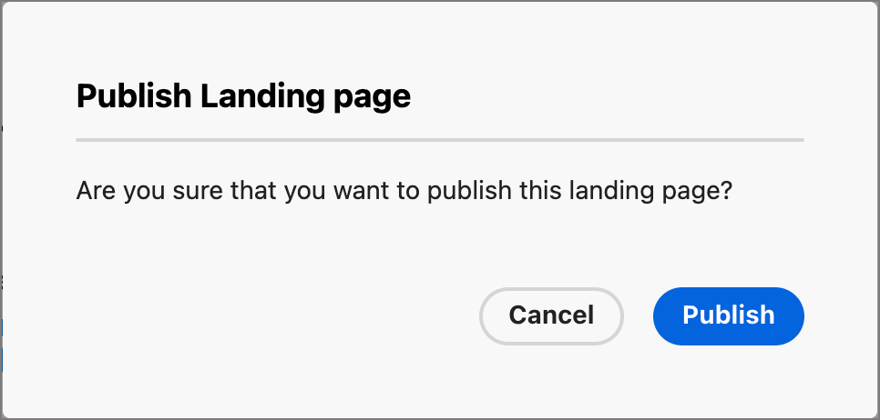

# Erstellen und Veröffentlichen von Landingpages

Als Marketing-Experte können Sie Seiten definieren und veröffentlichen, die Sie in Ihre Journey integrieren möchten. Wenn Sie eine neue Landingpage hinzufügen, konfigurieren Sie die Primärseite und alle Unterseiten, entwerfen Sie den Inhalt, testen Sie ihn und veröffentlichen Sie ihn.

>[!BEGINSHADEBOX]

## Voraussetzungen für die Landingpage {#landing-page-prerequisites}

Bevor Marketer Landingpages zur Unterstützung ihrer Journey erstellen können, müssen die folgenden Konfigurationen und Assets vorhanden sein:

* [Landingpage-Subdomain](../admin/configuration-presets-landing-pages.md#lp-subdomains) - Richten Sie eine Subdomain ein, die dem Hosten Ihrer Landingpages gewidmet ist.
* [Landingpage-Voreinstellung](../admin/configuration-presets-landing-pages.md#lp-presets) Eine Voreinstellung definiert die Subdomain und andere Einstellungen, die auf Ihre Landingpages angewendet werden.
* [Formular](./forms.md) (für Anwendungsfälle der Datenerfassung) - Erforderlich, wenn Sie ein Formular in eine Landingpage einbetten und Daten an Experience Platform senden möchten.

>[!ENDSHADEBOX]

## Erstellen einer Landingpage {#create-landing-page}

>[!CONTEXTUALHELP]
>id="ajo-b2b-prime_lp_create"
>title="Definition und Konfiguration Ihrer Landingpage"
>abstract="Um eine Landingpage zu erstellen, müssen Sie eine Voreinstellung auswählen, dann die primäre Seite und die untergeordneten Seiten konfigurieren und Ihre Seite schließlich testen, bevor Sie sie veröffentlichen."

Um Mitglieder einer Journey-Zielgruppe zu einer definierten Web-Seite weiterzuleiten, wenn sie auf einen bestimmten Link klicken, erstellen Sie in [!DNL Marketo Optimizer] eine Landingpage.

>[!IMPORTANT]
>
>Bevor Sie Ihre erste Landingpage erstellen, schließen Sie die Einrichtung der Landingpage ab. Dazu gehört das Konfigurieren einer Subdomain zum Hosten Ihrer Landingpages und das Definieren mindestens einer Voreinstellung, die die Subdomain und andere Kanaleinstellungen angibt. Sie wählen beim Erstellen der Landingpage eine Voreinstellung aus. Informationen zum Administrator-Setup finden Sie unter [Landingpage-Konfiguration](../admin/configuration-presets-landing-pages.md).
>
>Erstellen Sie für Anwendungsfälle der Datenerfassung ein [Formular](./forms.md) bevor Sie es in eine Landingpage einbetten.

_So erstellen Sie eine Landingpage :_

1. Navigieren Sie zur linken Navigation und wählen Sie **[!UICONTROL Content-Management]** > **[!UICONTROL Landingpages]**.

1. Klicken Sie in der Landingpage-Liste auf **[!UICONTROL Landingpage erstellen]**.

1. Geben Sie **[!UICONTROL Titel]** (erforderlich) und **[!UICONTROL Beschreibung]** (optional) ein.

   Titel- und Beschreibungskriterien:

   * **Titel** - Maximal 100 Zeichen. Muss eindeutig sein (ignoriert Groß- und Kleinschreibung).
   * **Beschreibung** - Maximal 300 Zeichen.
   * Alpha-, numerische und Sonderzeichen sind zulässig.
   * Reservierte Zeichen sind **_nicht zulässig_**: `\ / : * ? " < > |`

   {width="600"}

1. Wählen Sie eine **[!UICONTROL Voreinstellung]** aus.

   Ein Administrator [erstellt Landingpage-Voreinstellungen](../admin/configuration-presets-landing-pages.md#lp-presets) um die Subdomain und andere Einstellungen für Landingpages zu definieren. Wählen Sie eine Vorgabe aus und klicken Sie dann auf **[!UICONTROL Vorgabe anzeigen]**, um ihre Einstellungen zu überprüfen und zu bestätigen, dass sie Ihren Landingpage-Anforderungen entsprechen.

1. Klicken Sie auf **[!UICONTROL Erstellen]**.

   Die Primärseite und ihre Eigenschaften werden angezeigt. Erfahren Sie, wie [die Einstellungen der Primärseite konfigurieren](#configure-primary-page).

   {width="700" zoomable="yes"}

1. Um eine Unterseite hinzuzufügen (z. B. eine Danksagungs- oder Fehlerseite), klicken Sie auf das Symbol **+** .

   Pro Landingpage können bis zu zwei Unterseiten hinzugefügt werden.

Nachdem Sie die Primärseite und alle Unterseiten konfiguriert und gestaltet haben, [&#x200B; Sie Ihre Landingpage &#x200B;](#test-landing-page), bevor Sie sie veröffentlichen.

>[!CAUTION]
>
>Sie können nicht auf Ihre Landingpage zugreifen, indem Sie die definierte URL kopieren und in einen Webbrowser einfügen, selbst wenn die Seite veröffentlicht ist. Testen Sie die Seite mit der Vorschaufunktion, wie unter [&#x200B; der Landingpage beschrieben](#test-landing-page).

## Konfigurieren der Primärseite {#configure-primary-page}

>[!CONTEXTUALHELP]
>id="ajo-b2b-prime_lp_primary_page"
>title="Definieren der primären Seiteneinstellungen"
>abstract="Definieren Sie die Hauptseite, die sofort angezeigt wird, wenn ein Empfänger bzw. eine Empfängerin auf den Landingpage-Link klickt, beispielsweise in einer E-Mail oder auf einer Website."

>[!CONTEXTUALHELP]
>id="ajo-b2b-prime_lp_access_settings"
>title="Definieren Ihrer Landingpage-URL"
>abstract="Definieren Sie in diesem Abschnitt eine eindeutige Landingpage-URL. Für den ersten Teil der URL müssen Sie zuvor eine Landingpage-Subdomain als Teil der von Ihnen ausgewählten Voreinstellung eingerichtet haben."

Die Primärseite ist die Seite, die sofort angezeigt wird, wenn ein Empfänger auf den Landingpage-Link klickt, z. B. in einer E-Mail oder auf einer Website.

_So definieren Sie die Einstellungen der Primärseite :_

1. Ändern Sie den **[!UICONTROL Seitennamen]** entsprechend Ihren Anforderungen, der standardmäßig _Primär_ ist.

1. Definieren Sie den Endteil der Seiten-URL.

   Die von Ihnen ausgewählte Voreinstellung bestimmt den ersten Teil der URL. Ein Administrator konfiguriert die [Landingpage-Subdomain](../admin/configuration-presets-landing-pages.md#lp-subdomains) als Teil der Voreinstellung.

   >[!CAUTION]
   >
   >Die Landingpage-URL muss eindeutig sein.
   >
   >Sie können nicht auf Ihre Landingpage zugreifen, indem Sie diese URL kopieren und in einen Webbrowser einfügen, selbst wenn die Seite veröffentlicht ist. Testen Sie sie mithilfe der Vorschaufunktion, wie unter [&#x200B; der Landingpage beschrieben](#test-landing-page).

1. Wenn Sie eine anonyme Landingpage verwenden möchten, deaktivieren Sie die Option **[!UICONTROL Identifizierte Benutzer]**.

1. Klicken Sie auf _Kalender_ (  ), um den (**[!UICONTROL )]** festzulegen.

   Nachdem Sie ein Ablaufdatum ausgewählt haben, wählen Sie die Aktion nach Ablauf der Seite aus:

   * **[!UICONTROL Umleitungs-URL]** - Geben Sie die URL der Seite ein, die als Umleitung verwendet werden soll.

     {width="400"}

   * **[!UICONTROL Browser-Fehler]** - Geben Sie den Fehlertext ein, der anstelle der Seite angezeigt werden soll.

     {width="400"}

## Wählen des Inhaltserstellungstyps {#choose-design-type}

Um den _[!UICONTROL Inhalt]_ für die Seite hinzuzufügen, klicken Sie auf **[!UICONTROL Designer öffnen]**. Der Design-Prozess beginnt mit der Auswahl des gewünschten Startpunkts:

* [Von Grund auf gestalten](#design-from-scratch)
* [Importieren von HTML](#import-html)

{width="800" zoomable="yes"}

Nachdem Sie Ihre bevorzugte Methode zum Starten des Landingpage-Designs ausgewählt haben, verwenden Sie die visuellen Design-Tools, [&#x200B; den Seiteninhalt &#x200B;](./landing-page-design.md).

### Von Grund auf gestalten {#design-from-scratch}

Verwenden Sie den visuellen Inhaltsdesign-Bereich, um die Struktur und den Inhalt der Landingpage zu definieren. Durch das Hinzufügen und Verschieben von strukturellen Komponenten per Drag-and-Drop können Sie das Layout und die Organisation des Seiteninhalts innerhalb von Sekunden gestalten.

1. Wählen Sie auf der Startseite des Designs die Option **[!UICONTROL Erstellen von neuen Inhalten]** aus.

1. [Struktur und Inhalt hinzufügen](./landing-page-design.md#structure-content-landing-page) zur Seite hinzufügen.

1. [Überprüfen und Bearbeiten des verknüpften URL-Trackings](./landing-page-design.md#linked-url-tracking).

1. [Testen Sie die Landingpage](#test-landing-page).

Wenn Sie mit dem Inhalt zufrieden sind, klicken Sie auf **[!UICONTROL Speichern]**.

### Importieren von HTML {#import-html}

<!-- originally  from   /help/_includes/content-design-import.md but copied and revised to omit the part about Marketo Engage assets and AEM assets -->

Importierte Inhalte können:

* Eine HTML-Datei mit integriertem Stylesheet
* Eine ZIP-Datei, die eine HTML-Datei, das Stylesheet (.css) und Bilder enthält

  >[!NOTE]
  >
  >Die Dateistruktur des komprimierten Ordners ist freigestellt. Verweise müssen jedoch relativ sein und mit der Baumstruktur des ZIP-Ordners übereinstimmen. Die Bilder werden immer in das [Assets-Repository“ &#x200B;](./digital-asset-management.md).

_So importieren Sie eine Datei mit HTML-Inhalt :_

1. Wählen Sie auf der Startseite des Designs die Option **[!UICONTROL HTML importieren]** aus.

1. Ziehen Sie die HTML- oder ZIP-Datei mit Ihrem HTML-Inhalt per Drag-and-Drop und klicken Sie auf **[!UICONTROL Importieren]**.

{width="500"}

>[!NOTE]
>
>Einen `<table>`-Tag als erste Ebene in einer HTML-Datei zu verwenden kann zum Verlust des Stils führen, einschließlich der Einstellungen für Hintergrund und Breite im Tag der obersten Ebene.

Sie können den importierten Inhalt nach Bedarf mit den visuellen Design-Tools personalisieren.

## Prüfen von Warnhinweisen {#check-alerts}

Während Sie die Inhalte Ihrer Landingpage entwerfen, werden Warnhinweise oben rechts angezeigt, wenn wichtige Einstellungen fehlen.

{width="250"}

Wenn diese Schaltfläche nicht angezeigt wird, treten keine Probleme auf.

Es gibt zwei Arten von Warnhinweisen:

* **_Warnhinweise_** die auf Empfehlungen und Best Practices verweisen, z. B.:

  * `Placeholder links are present in the landing page body`: Vergessen Sie nicht, die Platzhalter durch gültige Links zu ersetzen.

  * `Text version of HTML is empty`: Vergessen Sie nicht, eine Textversion Ihres Seitentextes zu definieren, die verwendet wird, wenn HTML-Inhalte nicht angezeigt werden können.

  * `Empty link is present in page body`: Vergewissern Sie sich, dass alle Links auf Ihrer Seite korrekt sind.

* **_Fehler_** die verhindern, dass Sie den Journey testen oder aktivieren, solange nicht alle Fehler behoben sind, z. B.:

  * `The landing page content is empty`: Seiteninhalt ist obligatorisch.

## Testen der Landingpage {#test-landing-page}

>[!CONTEXTUALHELP]
>id="ajo-b2b-prime_preview_lp_profiles"
>title="Erstellen einer Vorschau und Testen Ihrer Landingpage"
>abstract="Nachdem Sie die Einstellungen und den Inhalt Ihrer Landingpage definiert haben, verwenden Sie Testprofile, um eine Vorschau der Seite anzuzeigen."

Wenn die Einstellungen und Inhalte der Landingpage definiert sind, können Sie Testprofile verwenden, um eine Vorschau der Seite anzuzeigen. Wenn Sie [personalisierten Inhalt](./landing-page-design.md#personalize-content) eingefügt haben, können Sie mithilfe von Testprofildaten überprüfen, wie dieser Inhalt auf der Landingpage angezeigt wird.

>[!PREREQUISITES]
>
>Um Landingpages in der Vorschau anzuzeigen und zu testen, benötigen Sie die Berechtigung **[!UICONTROL Nachrichten veröffentlichen]** und einen definierten Datensatz, der Testprofile enthält.

1. Klicken Sie **[!UICONTROL Vorschau und Test]**, um die Auswahl der Testprofile zu öffnen.

   >[!NOTE]
   >
   >Sie können auch **[!UICONTROL Inhalt simulieren]** verwenden, wenn Sie sich im visuellen Design-Bereich befinden.

1. Wählen Sie auf dem _[!UICONTROL Simulieren]_ ein Testprofil aus.

   {width="700" zoomable="yes"}

   Wenn die benötigten Profile nicht aufgelistet sind, klicken Sie auf **[!UICONTROL Testprofile verwalten]**, um eine bekannte E-Mail-Adresse für Testprofile zu verwenden und sie der Liste hinzuzufügen.

   +++Hinzufügen von Testprofilen

   Klicken **[!UICONTROL für]** Identity-Namespace _auf das Symbol Auswählen_ (  ) und wählen Sie den `Email`-Namespace aus, der zum Testen von Profilen verwendet werden soll.

   {width="700" zoomable="yes"}

   Geben Sie im Feld **[!UICONTROL Identitätswert]** die E-Mail-Adresse ein, um das Testprofil zu identifizieren, und klicken Sie auf **[!UICONTROL Profil hinzufügen]**. Sie können dies wiederholen, um mehrere Profile hinzuzufügen.

   {width="700" zoomable="yes"}

   Klicken Sie oben links auf den Rückwärtspfeil, um zur Seite _[!UICONTROL Simulieren]_ zurückzukehren.

   +++

1. Wählen Sie **[!UICONTROL Vorschau öffnen]**, um Ihre Landingpage zu testen.

   Die Landingpage-Vorschau wird auf einer neuen Registerkarte geöffnet. Die ausgewählten Testprofildaten ersetzen personalisierte Elemente.

   {width="600"}

1. Wählen Sie für jede Variante Ihrer Landingpage andere Testprofile zum Rendern von Vorschauen aus.

## Veröffentlichen der Seite {#publish-landing-page}

>[!PREREQUISITES]
>
>Um Landingpages zu veröffentlichen, benötigen Sie die Berechtigung **[!UICONTROL Nachrichten veröffentlichen]**. Prüfen [&#x200B; vor dem Veröffentlichen (alle Warnhinweise überprüfen und auflösen](#check-alerts).

Wenn die Entwurfsseite Ihren Kriterien entspricht und Sie sie für Verknüpfungen in Ihren Journey-Nachrichten verfügbar machen möchten, klicken Sie oben rechts **[!UICONTROL Veröffentlichen]**. Klicken Sie im Bestätigungsdialogfeld erneut **[!UICONTROL Veröffentlichen]** zur Bestätigung.

{width="250"}

Wenn die Landingpage veröffentlicht wird, wird sie in der Landingpage-Liste mit dem Status **_[!UICONTROL Veröffentlicht]_** angezeigt. Das bedeutet, dass sie live ist und in einer E-Mail oder SMS-Nachricht verwendet werden kann, die über eine Journey gesendet wird.

Sie können nicht auf die veröffentlichte Landingpage zugreifen, indem Sie die URL kopieren und in einen Webbrowser einfügen. Sie können sie jederzeit mit der &quot;[&quot; &#x200B;](#test-landing-page).
