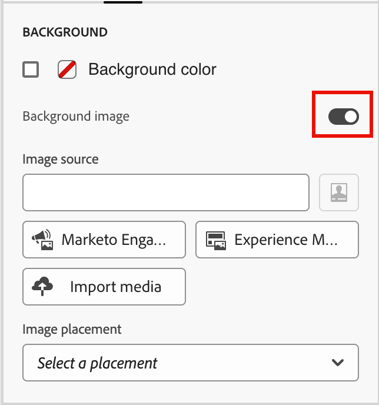
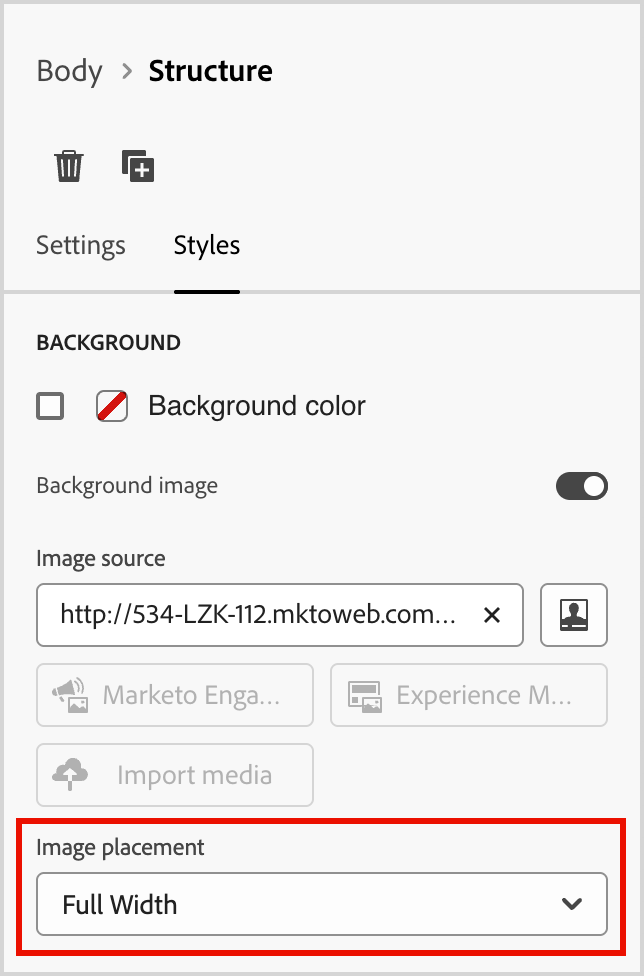
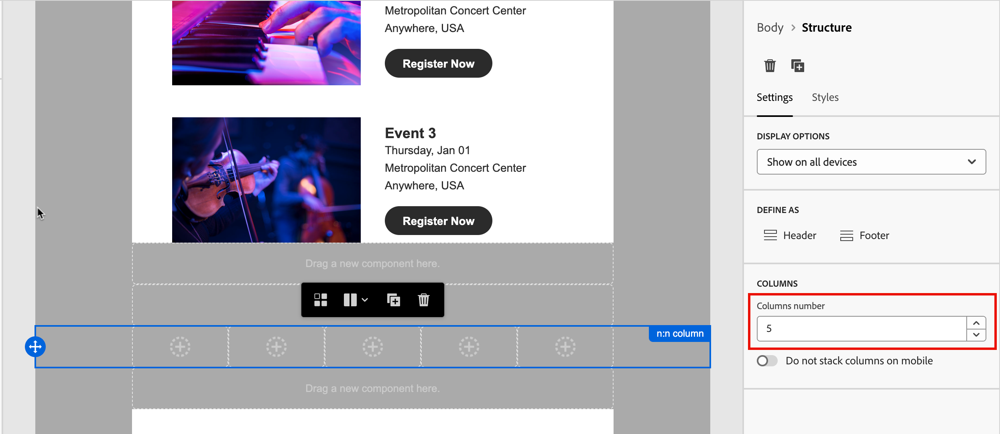

# Strukturkomponenten {#structure-components}

>[!CONTEXTUALHELP]
>id="ajo-b2b-prime_structure_components_email"
>title="Informationen zu Strukturkomponenten"
>abstract="Strukturkomponenten sind Layout-Elemente, mit denen Sie die Struktur einer E-Mail gestalten können."

>[!CONTEXTUALHELP]
>id="ajo-b2b-prime_structure_components_landing_page"
>title="Informationen zu Strukturkomponenten"
>abstract="Strukturkomponenten sind Layout-Elemente, mit denen Sie die Struktur einer Seite gestalten können."

>[!CONTEXTUALHELP]
>id="ajo-b2b-prime_structure_components_fragment"
>title="Informationen zu Strukturkomponenten"
>abstract="Strukturkomponenten sind Layout-Elemente, mit denen Sie die Struktur eines Fragments gestalten können."

>[!CONTEXTUALHELP]
>id="ajo-b2b-prime_structure_components_template"
>title="Informationen zu Strukturkomponenten"
>abstract="Strukturkomponenten sind Layout-Elemente, mit denen Sie die Struktur einer Vorlage gestalten können."

Verwenden Sie die _Strukturkomponenten_ im visuellen Design-Bereich, um die Struktur Ihrer Inhalte zu definieren. Durch das Hinzufügen und Verschieben von strukturellen Elementen mit einfachem Drag-and-Drop können Sie die Form Ihres Inhalts-Layouts schnell definieren. Jede Strukturkomponente erstreckt sich über den horizontalen Bereich und Sie können sie stapeln, um das Layout vertikal zu erstellen. <!-- Divide each component into columns to form each content block that you need, then add [content components](./content-components.md) inside them to populate the layout. -->

## Strukturbibliothek {#structure-library}

Oben in der _[!UICONTROL Komponenten]_ werden im Abschnitt **[!UICONTROL Strukturen]** die verfügbaren Strukturkomponenten angezeigt:

| Symbol | Komponente | Beschreibung |
| ----- | ----------- | ----------- |
|  | [!UICONTROL 1:1-Spalte] | Ein einspaltiger Container, der die Breite des Raums ausfüllt. |
|  | [!UICONTROL 1:2 Spalte Links] | Ein zweispaltiger Container, der ein Verhältnis von 1:2 verwendet, um die Breite des Raums auszufüllen. Die erste Spalte (links) nimmt ein Drittel der Breite ein, die zweite Spalte (rechts) die restlichen zwei Drittel. |
|  | [!UICONTROL 1:3 Spalte Links] | Ein zweispaltiger Container, der ein Verhältnis von 1:3 verwendet, um die Breite des Raums auszufüllen. Die erste Spalte (links) nimmt ein Viertel der Breite ein, die zweite Spalte (rechts) die restlichen drei Viertel. |
|  | [!UICONTROL 2:1 Spalte Rechts] | Ein zweispaltiger Container, der ein Verhältnis von 2:1 verwendet, um die Breite des Raums auszufüllen. Die erste Spalte (links) nimmt zwei Drittel der Breite ein, die zweite Spalte (rechts) das restliche Drittel. |
|  | [!UICONTROL 2:2 Spalte] | Ein zweispaltiger Container, der ein Verhältnis von 2:2 verwendet, um die Breite des Raums auszufüllen. Die linken und rechten Spalten haben die gleiche Breite. |
|  | [!UICONTROL 3:1 Spalte Rechts] | Ein zweispaltiger Container, der ein Verhältnis von 3:1 verwendet, um die Breite des Raums auszufüllen. Die erste Spalte (links) nimmt drei Viertel (75 %) der Breite ein, die zweite Spalte (rechts) das verbleibende Viertel (25 %). |
|  | [!UICONTROL :3 Spalte] | Ein dreispaltiger Container, der ein Verhältnis von 3:3 verwendet, um die Breite des Raums auszufüllen. Alle drei Spalten haben die gleiche Breite. |
|  | [!UICONTROL :4 Spalte] | Ein vierspaltiger Container, der ein Verhältnis von 4:4 verwendet, um die Breite des Raums auszufüllen. Alle vier Spalten haben die gleiche Breite. |
|  | [!UICONTROL n:n Spalte] | Eine anpassbare Spaltenstruktur, die den Raum entsprechend den von Ihnen definierten Spalten ausfüllt. Sie legen die Anzahl der Spalten (zwischen zwei und zehn) und die Breite jeder Spalte einzeln fest. [Weitere Informationen](#change-nn-columns) |

## Hinzufügen von Strukturkomponenten {#add-structure-components}

Wenn Sie den Inhalt für Ihre E-Mail, Landingpage oder Ihr Fragment entwerfen, fügen Sie jede Strukturkomponente hinzu, um das Layout zu erstellen. Ziehen Sie ein Element aus dem Abschnitt **[!UICONTROL Strukturen]** auf der linken Seite und legen Sie es auf der Arbeitsfläche ab. Sie können die Symbolleiste verwenden, um eine Spalte auszuwählen, und die Registerkarten _Einstellungen_ und _Stile_ im rechten Bedienfeld verwenden, um die Parameter für die ausgewählte Komponente oder Spalte zu definieren.

{width="800" zoomable="yes"}

### Komponenten-Symbolleiste {#component-toolbar}

Die Symbolleiste wird auf der Arbeitsfläche angezeigt, wenn Sie sie auf der Arbeitsfläche auswählen. Die verfügbaren Tools bieten eine einfache Möglichkeit, eine Spalte auszuwählen und Komponentenfunktionen anzuwenden.

{width="150"}

| Tool | Name | Nutzung |
| ---- | ---- | ----- |
| {width="40"} | Bedingten Inhalt aktivieren | (E-Mails und Fragmente) Aktivieren bedingter Varianten für die Komponente. |
| {width="100"} | Spalte auswählen | Wählen Sie eine Spalte anhand einer Zahl aus. Wenn die Spalte ausgewählt ist, können Sie Spalteneinstellungen und -stile anwenden. |
| {width="40"} | Duplizieren | Erstellen Sie eine Kopie der Komponente und fügen Sie sie direkt unten hinzu. |
| {width="40"} | Löschen | Entfernen Sie die Komponente. |

### Einstellungen der Komponente {#component-settings}

Nachdem Sie eine Komponente hinzugefügt haben, wird sie im visuellen Design-Bereich ausgewählt und ihre Eigenschaften werden im rechten Bedienfeld angezeigt. Die _[!UICONTROL Einstellungen]_ wird standardmäßig angezeigt. Sie können auch jederzeit eine Strukturkomponente auswählen, um die Einstellungen zu ändern.

#### Anzeigeoptionen

Wenn Sie die Komponente von der Desktop- oder Mobilgeräteanzeige ausschließen möchten, ändern Sie die Einstellung **[!UICONTROL Anzeigeoptionen]**. Die Standardeinstellung (_[!UICONTROL auf allen Geräten anzeigen]_ aktiviert die Anzeige auf allen Geräten.

{width="400" zoomable="yes"}

Wählen Sie eine andere Einstellung aus, um die Komponente nach Gerätetyp auszuschließen:

* _[!UICONTROL Nur auf Desktop-Geräten anzeigen]_ - Wählen Sie diese Einstellung, wenn Sie die Komponente auf Desktop-Geräten anzeigen und für Mobilgeräte ausschließen möchten.
* _[!UICONTROL Nur auf Mobilgeräten anzeigen]_ - Wählen Sie diese Einstellung, wenn Sie die Komponente auf Mobilgeräten (wie Smartphones und Tablets) anzeigen und von Desktop-Geräten ausschließen möchten.

#### Kopf- und Fußzeile

Sie können eine Strukturkomponente als Kopf- oder Fußzeile von HTML in der E-Mail-Nachricht oder Landingpage festlegen. Klicken Sie bei ausgewählter Strukturkomponente auf der Arbeitsfläche auf die Option **[!UICONTROL Kopfzeile]** oder **[!UICONTROL Fußzeile]**. Es kann nur eine Kopf- oder Fußzeile geben, und die Option ist nicht verfügbar, wenn eine andere Komponente zugewiesen ist.

{width="600" zoomable="yes"}

Sie können die Kopf- oder Fußzeilenbezeichnung entfernen, indem Sie die Komponente auswählen und auf die Option klicken, um sie zu entfernen.

### Gestapelte Spalten {#stacked-columns}

Bei kleineren Bildschirmen oder Anzeigefenstern werden die Spalten in der Strukturkomponente als gestapelt angezeigt, es sei denn, Sie ändern die Standardeinstellung. Wenn Sie die mehrspaltige Strukturkomponente ausgewählt haben, ändern Sie die Einstellung **[!UICONTROL Spalten auf Mobilgeräten nicht stapeln]** indem Sie den Schieberegler nach rechts verschieben.

{width="250"}

## Komponentenstile {#component-styles}

Nachdem Sie eine Komponente hinzugefügt haben, wird sie im visuellen Design-Bereich ausgewählt und ihre Eigenschaften werden im rechten Bedienfeld angezeigt. Sie können auch jederzeit eine Komponente auswählen, um die Einstellungen und Stile zu ändern.

### Hintergrund {#background}

Wenn Sie die _[!UICONTROL Stile]_ im rechten Bereich ausgewählt haben, verwenden Sie den Abschnitt **[!UICONTROL Hintergrund]**, um die Farbe und das optionale Bild zu definieren, die als Hintergrund für die Strukturkomponente verwendet werden sollen.

#### [!UICONTROL Hintergrundfarbe]

Aktivieren Sie das Kontrollkästchen und klicken Sie auf das Farbfeld, um eine Farbe aus der Auswahl auszuwählen. Sie können eine Farbe auswählen, indem Sie einen bekannten RGB-, HSL-, HSB- oder Hexadezimalwert eingeben. Sie können auch den Farbregler und das Farbfeld verwenden, um die Farbe auszuwählen.

{width="300"}

#### [!UICONTROL Hintergrundbild] {#background-image}

Bewegen Sie den Umschalter, um die Einstellungen für das Hintergrundbild zu aktivieren.

{width="250"}

Klicken Sie auf **[!UICONTROL Asset auswählen]**, um den Asset-Wähler zu öffnen, in dem Sie ein Bild aus der [Assets-Bibliothek auswählen können](./digital-asset-management.md#assets-authoring).

Verwenden Sie die Option **[!UICONTROL Bildplatzierung]**, um festzulegen, wie das Bild die Strukturkomponente ausfüllt. Die Platzierungseinstellungen entsprechen den standardmäßigen [HTML-Hintergrundbildfüllungs- und -ausrichtungsattributen](https://www.w3schools.com/html/html_images_background.asp){target="_blank"}.

{width="250"}

### Andere Stile {#other-styles}

Sie können andere Strukturkomponentenstile anwenden, um ihre Anzeige in der E-Mail-Nachricht oder Landingpage anzupassen. Informationen zum Formatieren über diese integrierten Optionen hinaus finden Sie unter [Hinzufügen von benutzerdefiniertem CSS für Ihre Inhalte](./design-custom-css.md).

+++Rahmen

{{styles-border}}

+++

+++Spanne

{{styles-margin}}

+++

+++Erweitert

{{styles-advanced}}

+++

## Spalten {#columns}

Wählen Sie mit dem _Spalte auswählen_ in der Komponenten-Symbolleiste eine Spalte aus. Anschließend können Sie die Spaltensymbolleiste verwenden, um die Spaltenauswahl zu ändern, die Spalte zu entfernen oder bedingte Inhaltsvarianten für die Spalte anzuwenden. Die Parameter für die Spalte werden auf den Registerkarten _[!UICONTROL Einstellungen]_ und _[!UICONTROL Stile]_ auf der rechten Seite angezeigt.

{width="500"}

| Tool | Name | Nutzung |
| ---- | ---- | ----- |
| – | Spalte löschen | Inhalt in der Spalte löschen. Siehe das erste Tool in der Spalten-Symbolleiste Abbildung. |
| {width="40"} | Bedingten Inhalt aktivieren | (E-Mails und Fragmente) Aktivieren bedingter Varianten für die Spalte. |
| {width="100"} | Spalte auswählen | Wählen Sie eine Spalte anhand einer Zahl aus. Wenn die Spalte ausgewählt ist, können Sie Einstellungen und Stile anwenden. |

### Ändern von n:n Spalten {#change-nn-columns}

Die Spaltenbreiten sind für die meisten Strukturkomponenten statisch. Wenn Sie die Komponente _[!UICONTROL n:n Column]_ hinzufügen, können Sie die Anzahl der Spalten und die Spaltengröße ändern. Die n:n-Spaltenkomponente beginnt mit fünf Spalten gleicher Breite (20 %).

>[!NOTE]
>
>Die Größe einer Spalte darf nicht kleiner als 10 % der Gesamtbreite der Strukturkomponente sein. Nur leere Spalten können entfernt werden.

Wenn die Komponente auf der Arbeitsfläche ausgewählt ist, verwenden Sie die Option **[!UICONTROL Spaltennummer]** im rechten Bedienfeld, um die Anzahl der Spalten zu ändern. Klicken Sie auf die Pfeilsymbole nach oben und unten, um die Anzahl der Spalten zu erhöhen oder zu verringern, oder geben Sie die Zahl in das Feld ein.

{width="650" zoomable="yes"}

Verschieben Sie auf der Arbeitsfläche das Symbol für die Spaltengröße, um die Breite der ausgewählten Spalte anzupassen. Beim Erhöhen oder Verringern der Breite wird die angrenzende Spalte auch so angepasst, dass alle Spalten 100 % der Komponentenbreite einnehmen.

{width="500" zoomable="yes"}

### Spaltenstile {#column-styles}

Wenn die Spalte auf der Arbeitsfläche ausgewählt ist, können Sie Stile festlegen, die auf diese Spalte angewendet werden.

+++Hintergrund

* **[!UICONTROL Hintergrundfarbe]** - Aktivieren Sie das Kontrollkästchen und klicken Sie auf das Farbfeld, um eine Farbe aus der Auswahl auszuwählen. Sie können eine Farbe auswählen, indem Sie einen bekannten RGB-, HSL-, HSB- oder Hexadezimalwert eingeben. Sie können auch den Farbregler und das Farbfeld verwenden, um die Farbe auszuwählen.

  {width="300"}

* **[!UICONTROL Hintergrundbild]** - Verschieben Sie den Umschalter, um die Einstellungen für das Hintergrundbild zu aktivieren.

  {width="250"}

  Wählen Sie den Asset-Quelltyp und [wählen Sie eine Bilddatei aus](#background-image).

+++

+++Rahmen

{{styles-border}}

+++

+++Ausrichtung

{{styles-alignment-v}}

+++

+++Spanne

{{styles-margin}}

+++

+++Erweitert

{{styles-advanced}}

+++

## Navigationsbaum {#navigation-tree}

Im visuellen Design können Sie über den Navigationsbaum auf die Strukturkomponenten, einschließlich Spalten und Inhalten, zugreifen. Klicken Sie _[!UICONTROL links auf das Symbol]_ Navigationsbaum Navigationsbaum) ), um die Baumstruktur anzuzeigen.

{width="800" zoomable="yes"}

Das _[!UICONTROL body]_-Element ist der Stamm der Baumstruktur. Klicken Sie auf eine der Komponenten oder untergeordneten Spaltenelemente in der Baumstruktur, um sie auf der Arbeitsfläche auszuwählen. Die _[!UICONTROL Einstellungen]_ und _[!UICONTROL Stile]_ auf der rechten Seite zeigen die Parameter für diese Komponente oder Spalte an.

{width="800" zoomable="yes"}
