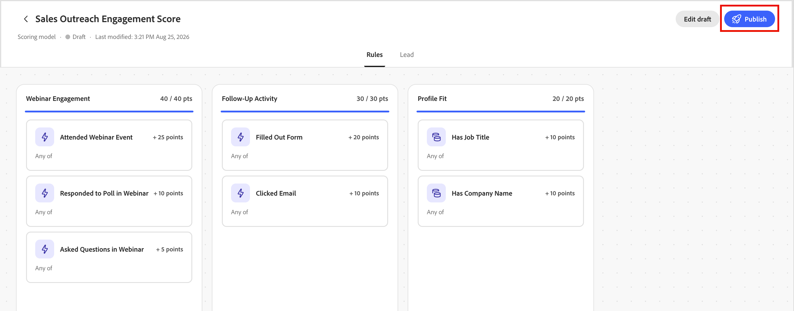
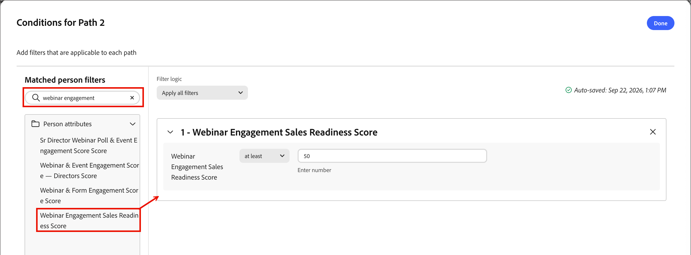

# Scoring Studio

Scoring Studio enthält eine Modellliste, eine bearbeitbare Arbeitsfläche für jedes Modell und die [Coworker chat-Oberfläche](../agents/chat-interface.md). Verwenden Sie die Arbeitsfläche, um Dimensionen und Signale direkt zu überprüfen oder anzupassen, während Coworker weiterhin Änderungen in natürlicher Sprache mit Ihnen vorschlägt. Weitere Informationen zum Erstellen eines Modells über eine Eingabeaufforderung finden Sie unter [_Erstellen benutzerdefinierter Bewertungsmodelle_](../agents/lead-scoring-model.md).

## Modellliste {#model-list}

Die Modellliste ist die Landingpage-Ansicht für Scoring Studio. Jedes Scoring-Modell in Ihrer [!DNL Marketo Optimizer]-Instanz wird als Zeilen in einer Tabelle oder als Karten angezeigt, wenn Sie zur Rasteransicht wechseln.

{width="800" zoomable="yes"}

| Spalte | Beschreibung |
| --- | --- |
| Name | Wählen Sie einen Modellnamen aus, um ihn auf der Arbeitsfläche zu öffnen. |
| Status | _[!UICONTROL aktiv]_, _[!UICONTROL Entwurf]_ oder _[!UICONTROL archiviert]_. |
| Dimensionen | Die Anzahl der Dimensionen im Modell. |
| Signale | Die Anzahl der Signale im Modell. |
| Zuletzt geändert | Das Datum der letzten Änderung des Modells. |
| Zuletzt geändert von | Die Person, die das Modell zuletzt geändert hat. |
| Erstellt am | Das Datum der Modellerstellung. |
| Erstellt von | Die Person, die das Modell erstellt hat. |

Verwenden Sie das Suchfeld, um ein Modell nach Namen zu suchen, oder filtern Sie die Liste nach Status. Wählen Sie das Menü **[!UICONTROL Mehr]** einer Zeile aus, um ein Modell **[!UICONTROL Bearbeiten]**, **[!UICONTROL Duplizieren]**, **[!UICONTROL Archivieren]** oder **[!UICONTROL Löschen]**.

Ein aktives Modell ist schreibgeschützt. Um sie zu ändern, duplizieren Sie sie und bearbeiten Sie das Duplikat. Archivieren Sie dann das Original und veröffentlichen Sie die geänderte Kopie.

## Modell-Arbeitsfläche {#model-canvas}

Wenn Sie einen Modellnamen auswählen, wird er auf der Arbeitsfläche geöffnet. Jedes geöffnete Modell wird als eigene Registerkarte angezeigt, sodass Sie über mehrere Modelle hinweg arbeiten können. Die Arbeitsfläche ist in Registerkarten unterteilt, einschließlich **[!UICONTROL Regeln]** und **[!UICONTROL Lead]**.

Auf der Registerkarte **[!UICONTROL Regeln]** ist jede Dimension im Modell eine Spalte auf der Arbeitsfläche. Jede Spaltenüberschrift zeigt den Dimensionsnamen und den Gesamtwert des Punkts gegenüber der Obergrenze an, z. B. `20 / 30 pts`, mit einer Fortschrittsleiste, die gefüllt wird, wenn die Signale Punkte beitragen.

{width="700" zoomable="yes"}

Innerhalb jeder Dimension wird jedes Signal als Karte angezeigt, die seinen Namen, seinen Punktwert und entweder seine entsprechende Häufigkeit (z. B. `1 time / day`) oder `Static` für attributbasierte Signale anzeigt, die nicht von Aktivität abhängig sind.

Wenn ein Coworker ein Muster über mehrere Aktivitäten hinweg erkennt, kann es diese zu einer einzigen zusammengesetzten Signalkarte kombinieren, die jede Bedingung zusammenfasst.

## Konfigurieren eines Signals {#configure-signal}

Gehen Sie wie folgt vor, um ein Signal zu überprüfen oder zu ändern.

1. Wählen Sie **[!UICONTROL Entwurf bearbeiten]** aus.

1. Wählen Sie eine Signalkarte auf der Arbeitsfläche aus.

   Das Bedienfeld Eigenschaften wird auf der rechten Seite der Arbeitsfläche geöffnet.

   {width="700" zoomable="yes"}

1. Wählen Sie das **[!UICONTROL Bearbeiten]**-Symbol (  ) aus und aktualisieren Sie dann die Signaleigenschaften:

   * Bestätigen **[!UICONTROL unter]** den Signaltyp (eine Aktivität oder ein Attribut) und die bewertete spezifische Aktivität oder das bewertete Attribut.

   * Legen **[!UICONTROL unter &quot;]** auslösen“ die Bedingungen fest, die übereinstimmen müssen.

     Fügen Sie die zu verwendenden Elemente hinzu, z. B. bestimmte Seiten **[!UICONTROL und ob]** eine von) oder **[!UICONTROL alle]** Bedingungen erfüllt sein müssen.

   * Legen **[!UICONTROL unter]** fest, wie viele Punkte das Signal beiträgt.

     Optional können Sie eine **[!UICONTROL Obergrenze]** festlegen, um zu begrenzen, wie viele Punkte pro Person beigetragen werden können. Kollege zeigt einen vorgeschlagenen Punktbereich basierend auf den anderen Signalen im Modell an.

   * Stellen Sie für aktivitätsbasierte Signale die **[!UICONTROL Frequenz]** ein, die erforderlich ist, bevor das Signal Punkte verleiht.

     Optional können Sie einen **[!UICONTROL Abklingprozentsatz]** festlegen, der die Signalpunkte nach einer bestimmten Anzahl von Tagen verringert.

   * Aktivieren Sie die Option **[!UICONTROL Vermeiden Sie es, dieselben Aktionen zweimal zu bewerten]**, damit Punkte nur einmal pro Person vergeben werden, unabhängig davon, wie oft die Aktivität stattfindet.

     Deaktivieren Sie diese Option, um bei jeder Aktivität Punkte zu vergeben. Diese Einstellung ist standardmäßig aktiviert.

1. Wählen Sie **[!UICONTROL Speichern]** aus, um Ihre Änderungen anzuwenden und zur Arbeitsfläche zurückzukehren.

## Lead-Segment {#lead-segment}

Jedes Scoring-Modell bewertet ein Lead-Segment, d. h. einen Verweis auf eine vorhandene Personenliste anstelle der in Scoring Studio definierten Regeln. Wenn ein Mitarbeiter ein Modell erstellt, wählt er eine passende Liste aus oder erstellt eine neue.

Um die Liste zu ändern, wählen **[!UICONTROL die Registerkarte]** Lead **[!UICONTROL aus und klicken]** neben dem Lead-Segment auf Ändern.

{width="700" zoomable="yes"}

Ein Lead-Segment verwendet einen von zwei Listentypen:

* **Statische Liste** - Eine feste Gruppe von Personen, die bei der Erstellung der Liste erfasst wurde.
* **Smart List** - eine Liste, die ihre Mitgliedschaftsregeln bei jeder Ausführung des Modells neu bewertet, sodass das Segment immer die Listenkriterien widerspiegelt.

Die Modellvorschau zeigt den Segmentnamen, die Anzahl der Mitglieder und einen Link **[!UICONTROL Liste der Personen anzeigen]** der die Liste direkt öffnet. Weitere Informationen zum Verwalten von Listen finden Sie unter [_Personenlisten_](../audiences/people-lists.md).

Wenn die referenzierte Liste leer ist oder später entfernt wird, wird das Modell nicht mehr bewertet, sondern fällt auf Ihre gesamte Audience zurück. Leads werden erst bewertet, wenn eine gültige, nicht leere Liste zugewiesen wird.

Unterhalb des Lead-Segments zeigt die Karte **[!UICONTROL Name des Bewertungsfelds]** das Lead-Attribut an, in das das Modell seine Bewertung schreibt. Standardmäßig entspricht der Feldname dem Modellnamen. Wählen Sie **[!UICONTROL Bearbeiten]** aus, um sie umzubenennen.

## Veröffentlichen und Planen {#publish-schedule}

Wenn Ihr Modell fertig ist, klicken Sie auf **[!UICONTROL Veröffentlichen]**.

{width="700" zoomable="yes"}

Wählen Sie aus, wie oft das Modell Ihre Audience bewertet: täglich, wöchentlich oder monatlich. Sie können auch eine manuelle Option auswählen, um das Modell auszuführen.

{width="420" zoomable="no"}

Den vollständigen Veröffentlichungsprozess mit der [Coworker chat-Schnittstelle](../agents/chat-interface.md) einschließlich [!DNL Marketo Optimizer] automatischen Bereitstellung eines Bewertungsfelds finden Sie unter [_Veröffentlichen eines Bewertungsmodells_](../agents/lead-scoring-model.md#publish-model).

Die aktuellen Bewertungen werden in einem bereitgestellten Feld gespeichert, das mit Ihrer [!DNL Marketo Engage] synchronisiert wird.

{width="800" zoomable="yes"}

## Scores in Filtern verwenden {#filter-score}

Nach dem [Veröffentlichen eines Modells](#publish-schedule) können Sie den resultierenden Score als Filter beim Erstellen ereignisbasierter Zielgruppen und _Lauschen auf ein Ereignis_ Knoten, als Bedingung für einen aufgeteilten Pfad oder für die Mitgliedschaft in der Personenliste verwenden.

Der Score wird im Bedienfeld Filter unter der Kategorie **[!UICONTROL Personenattribute]** angezeigt und ist mit dem Modellnamen oder dem benutzerdefinierten [_Score-Feldnamen_](#lead-segment) beschriftet, den Sie ihm zugewiesen haben. Geben Sie diesen Namen in das Suchfeld des Filterbedienfelds ein, um den Score zu finden, ziehen Sie ihn dann auf die Arbeitsfläche und definieren Sie Ihre Kriterien.

### Ereignisbasierte Zielgruppen und Knoten {#scoring-model-event-audience}

So verwenden Sie ein Scoring-Modellergebnis, um nach einer [ereignisbasierten Zielgruppe](../audiences/event-based-audiences.md) oder [_auf einen_ zu filtern](../marketing/listen-for-event-nodes.md):

1. Klicken Sie **[!UICONTROL Ereigniskriterien hinzufügen]**.

1. Wählen _[!UICONTROL Dialogfeld „Ereigniskriterien bearbeiten]_ die Registerkarte **[!UICONTROL Filter]** aus.

1. Geben Sie den Modellnamen in das Suchfeld ein und ziehen Sie die Punktzahl auf die Arbeitsfläche.

   {width="700" zoomable="yes"}

1. Stellen Sie den Operator und den Wert so ein, dass sie mit den Werten übereinstimmen, die Sie ansprechen möchten.

1. Klicken Sie auf **[!UICONTROL Speichern]**.

### Bedingungen für aufgeteilten Pfad {#split-path-conditions}

So verwenden Sie ein Scoring-Modellergebnis, um Pfadbedingungen für einen [_Pfade aufteilen_-Knoten zu ](../marketing/split-merge-paths-nodes.md):

1. Klicken Sie **[!UICONTROL Knotenpfad auf]** Bedingung bearbeiten“.

1. Geben _[!UICONTROL im Dialogfeld Bedingungen]_ den Modellnamen in das Suchfeld ein und ziehen Sie dann die entsprechende Bewertung auf die Arbeitsfläche.

   {width="700" zoomable="yes"}

1. Stellen Sie den Operator und den Wert so ein, dass sie mit den Werten übereinstimmen, die Sie ansprechen möchten.

1. Klicken Sie **[!UICONTROL Fertig]**, um die Bedingung für den Pfad zu speichern.

### Mitgliedschaft in der Personenliste {#scoring-model-people-lists}

So verwalten Sie [Personenliste](../audiences/people-lists.md) Mitgliedschaft mithilfe eines Scoring-Modells:

**Statische Liste - Mitglieder hinzufügen**

1. Öffnen Sie die statische Liste und klicken Sie auf **[!UICONTROL Personen hinzufügen]**.

1. Geben _[!UICONTROL im Dialogfeld „Personen]_&quot; den Modellnamen in das Suchfeld ein und ziehen Sie dann die entsprechende Bewertung auf die Arbeitsfläche.

   {width="700" zoomable="yes"}

1. Stellen Sie den Operator und den Wert so ein, dass sie mit den Werten übereinstimmen, die Sie ansprechen möchten.

1. Klicken Sie **[!UICONTROL Fertig]**, um den Filter anzuwenden und passende Personen für die Liste zu qualifizieren.

**Dynamische Liste - Festlegen von Mitgliedschaftsregeln**

1. Öffnen Sie die dynamische Liste und wählen Sie die Registerkarte **[!UICONTROL Regeln]** aus.

1. Klicken Sie **[!UICONTROL Regeln bearbeiten]**.

1. Geben _[!UICONTROL im Dialogfeld Regeln bearbeiten]_ den Modellnamen in das Suchfeld ein und ziehen Sie dann das Bewertungselement auf die Arbeitsfläche.

   {width="700" zoomable="yes"}

1. Stellen Sie den Operator und den Wert so ein, dass sie mit den Werten übereinstimmen, die Sie ansprechen möchten.

1. Klicken Sie **[!UICONTROL Fertig]**, um die Regel zu speichern.

   Die Mitgliedschaft wird automatisch aktualisiert, wenn Personendatensätze anhand der Regel ausgewertet werden.
