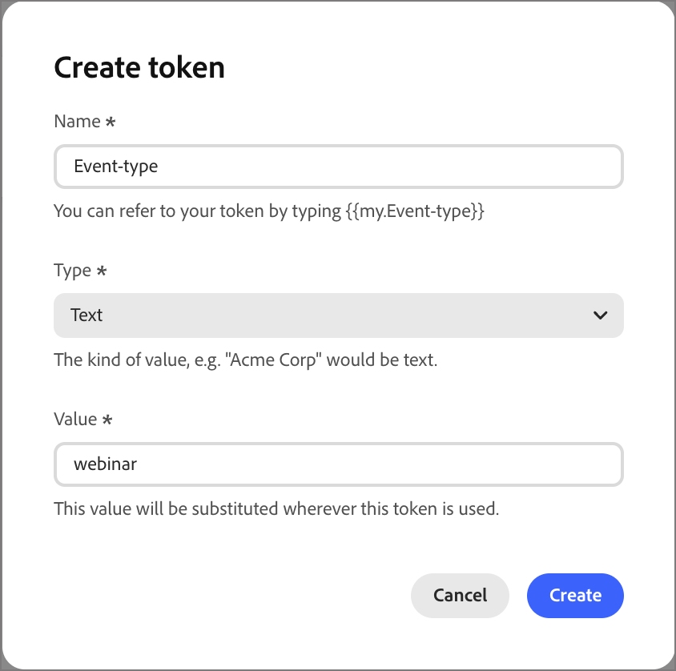

# Benutzerdefinierte Token für die Personalisierung

Die Inhaltspersonalisierung verwendet Token als Platzhalter oder Variablen, die beim Generieren des Inhaltsartefakts aufgefüllt werden. Standard-Personalisierungs-Token sind für E-Mails, Landingpages, Fragmente und Vorlagen verfügbar. Sie können auch einen Satz benutzerdefinierter Token mit Werten definieren, die für das Programm oder den Ordner spezifisch sind. Dieser Satz benutzerdefinierter Token wird als &quot;_Token“_. Alle diese benutzerdefinierten Token können personalisiert werden.

<!-- 
When you add a custom token to an email, it is displayed as `{{my.TokenName}}`. For example, you might have `{{my.EventDate}}` or `{{my.WebinarSpeaker}}` tokens created to manage email content related to upcoming webinars in your program.
-->

Zusätzlich zu _Meine Token_ die spezifisch für das Programm oder den Ordner sind, können Sie jedes der standardmäßigen (integrierten) Token für die Personalisierung verwenden.

>[!IMPORTANT]
>
>In der ersten Marketo Optimizer-Version _Meine Token_ für die Aktionsknoten zum Ändern des Datenwerts unterstützt und sind auf die Verwendung in Zeichenfolgen- und Textattributen beschränkt. _Meine Token_ sind **nicht** derzeit im Personalization-Editor aktiviert.

## Zugriffstoken {#access-tokens}

1. Erweitern Sie in der linken Navigation **[!UICONTROL Marketing-Verwaltung]**.

1. Wählen Sie rechts in der **[!UICONTROL Marketing]**-Ressourcenliste **[!UICONTROL Programme]** aus.

1. Wählen Sie in der Baumstruktur das Programm oder den Ordner aus, um die Details im mittleren Arbeitsbereich zu öffnen.

1. Klicken Sie auf die **[!UICONTROL Token]**.

   {width="800" zoomable="yes"}

   Auf der Registerkarte werden alle benutzerdefinierten Token angezeigt, die im Ordner oder Programm definiert sind, sowie alle für übergeordnete Ordner oder Programme definierten.

### Tokentypen {#my-tokens}

Die _Meine Token_ sind benutzerdefinierte Variablen, die Sie für ein Programm oder einen Ordner erstellen oder ändern. Dieser benutzerdefinierte Token-Satz unterstützt die folgenden Token-Typen:

| Token-Typ | Beschreibung |
| ---------- | ----------- |
| Text | Dieser Typ enthält eine standardmäßige Textzeichenfolge. Die Größenbeschränkung für Text-Token beträgt 524.288 Zeichen (UTF-8) oder 2 MB. |
| Datum | Dieser Typ enthält einen Datumswert. Das Datum wird als Monat-Tag-Jahr angezeigt (z. B. 09-23-2026). |
| Datum und Uhrzeit | Dieser Typ enthält einen Datums- und Uhrzeitwert. |
| Zahl | Dieser Typ enthält einen ganzzahligen Standardwert. |
| E-Mail | Dieser Typ enthält eine gültige E-Mail-Adresse. |
| Ergebnis | Verwenden Sie dieses Token, um die Punktzahl für einen Journey-Aktionsknoten zu ändern. |
| Boolesch | Dieser Typ enthält den booleschen Standardwert true oder false. |
| RTF | Dieser Typ enthält formatierten Text. |

### Token-Verschachtelung {#nesting}

Wenn Sie ein Token in einem Programm oder Ordner erstellen, ist es für Verweise durch Objekte innerhalb der Hierarchie verfügbar.

* **Lokales**: Das Token wird im selben Programm oder Ordner definiert.
* **Vererbtes Token** - Das Token wird in einem übergeordneten Programm oder Ordner definiert und liegt eine oder mehrere Ebenen über dem aktuellen Programm oder Ordner.
* **Überschriebenes Token** - Das Token wird in einem übergeordneten Programm oder Ordner definiert, aber im aktuellen Programm oder Ordner wird ein anderer Wert definiert. Der Token-Status ändert sich in _Überschrieben_ und alle untergeordneten Ordner, Programme und Marketing-Artefakte übernehmen den neuen Wert.

{width="600" zoomable="yes"}

### Erstellen eines Tokens {#create}

1. Klicken Sie auf der _[!UICONTROL Token]_-Registerkarte auf **[!UICONTROL Erstellen]**.

1. Geben Sie im Dialogfeld den **[!UICONTROL Namen]** für das Token ein.

   {width="400"}

   Sie können im Token-Namen keine Leerzeichen oder Sonderzeichen verwenden. Sie können _Binnenmajuskel-Schreibweise_ wie `EventType` verwenden, um einen Namen mit mehreren Wörtern zu verwenden, der leicht zu identifizieren ist.

1. Wählen Sie den **[!UICONTROL Typ]** für das Token.

1. Legen Sie den **[!UICONTROL Wert]** für das Token fest.

1. Klicken Sie auf **[!UICONTROL Erstellen]**.

### Token bearbeiten {#edit}

Sie können den Wert für jedes der definierten Token bearbeiten, wodurch der Wert für ein geerbtes Token überschrieben wird.

<!-- (How does this affect live person journeys? ) -->

1. Klicken Sie auf _[!UICONTROL Token]_ auf das Symbol _Bearbeiten_ neben dem Token-Namen.

1. Ändern Sie im Feld den Wert nach Bedarf.

   {width="400"}

1. Klicken Sie auf das _Speichern_-Symbol.

### Token löschen {#delete}

Sie können ein benutzerdefiniertes Token aus der Liste löschen, wenn es derzeit nicht zum Journey von E-Mail-Inhalten verwendet wird.

1. Klicken Sie auf _[!UICONTROL Token]_ auf das Symbol _Löschen_ neben dem Token-Namen.

1. Klicken Sie im Bestätigungsdialog auf **[!UICONTROL Löschen]**.

## AutoSuggest und Preview {#autosuggest}

Wenn Sie einen _Datenwert ändern_-[-Knoten ](./action-nodes.md) Ihrem Journey einfügen, können Sie `{{` in das Feld **[!UICONTROL Neuer Wert]** eingeben, um das Menü Token _AutoSuggest_ anzuzeigen. In der angezeigten Liste werden unterstützte Namespaces und einzelne Token angezeigt. Es werden nur Token eines kompatiblen Datentyps aufgelistet.

Bei _Meine Token_ wird eine Vorschau des Token-Werts mit dem Token-Namen angezeigt, um die Auswahl des richtigen Werts zu vereinfachen.

{width="500" zoomable="yes"}

<!--

## Use custom tokens in your content

When you are authoring email content for your programs, you can use any of the tokens from the _My Tokens_ list when you use the personalization tools in the visual design space.

1. Select the text component and click the _Add personalization_ (  ) icon in the toolbar.

   {width="600"}

   This action opens the _Edit Personalization_ dialog. The dialog includes a _[!UICONTROL My tokens]_ folder in the _[!UICONTROL Personalization Tokens]_ library if there are custom tokens defined for the account journey.

1. To add one of your custom tokens to the blank space, expand the **[!UICONTROL My tokens]** folder, then click **+** or **...**.

   You can add any additional static text as needed.

   {width="700" zoomable="yes"}

1. Click **[!UICONTROL Save]**.

-->
