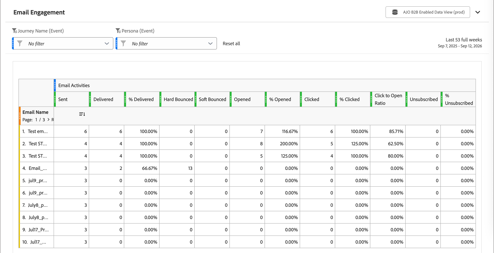

# Email Engagement Report

<!-- SPHR-32511: Filter by Program, Filter by Audience, and the program data point for the email performance table are not documented here pending delivery. -->

Verwenden Sie den Bericht [!UICONTROL E-Mail]Interaktion), um die Zustellbarkeit der E-Mails und die Interaktionsleistung in Ihrer gesamten Instanz zu überprüfen, aufgeschlüsselt nach E-Mail und Journey.

_Bericht anzeigen :_

1. Wählen Sie in der linken Navigationsleiste die Option **[!UICONTROL Berichte]**.
1. Klicken Sie auf _Listen_-Symbol (  ) und wählen Sie **[!UICONTROL E-Mail-]** im Bedienfeld _[!UICONTROL Inhaltsverzeichnis]_ aus.

{width="700" zoomable="yes"}

Sie können [ Datumsbereich ändern](./reports-overview.md#change-the-date-range) indem Sie dieselbe Datumsbereichsauswahl verwenden, die in anderen Berichtsabschnitten verfügbar ist.

Wählen **[!UICONTROL oben]** Bericht die Option „Freigeben“ aus, um den Export aller Berichtsdaten herunterzuladen oder zu planen. Siehe [_Exportieren eines Berichts_](./reports-overview.md#export-a-report) in der Übersicht über Berichte.

## Berichtstabelle {#report-table}

Der [!UICONTROL E-Mail]Interaktionsbericht zeigt für jede E-Mail eine Zeile mit den folgenden Zeilendimensionen an.

* **[!UICONTROL Email Name]** - Der Name der E-Mail.
* **[!UICONTROL Journey-Name]** - Der Name der Journey, die die E-Mail gesendet hat.

Metrikspalten sind unter **[!UICONTROL E-Mail-Aktivitäten]** gruppiert.

| Spalte | Beschreibung |
| --- | --- |
| [!UICONTROL gesendet] | Anzahl der gesendeten E-Mails. |
| [!UICONTROL Zugestellt] | Anzahl der zugestellten E-Mails. |
| [!UICONTROL  % Zugestellt] | Prozentsatz der gesendeten E-Mails, die zugestellt wurden |
| [!UICONTROL Hardbounce] | Anzahl der E-Mails, die dauerhaft nicht zugestellt werden konnten. |
| [!UICONTROL Softbounce] | Anzahl der E-Mails, die vorübergehend nicht zugestellt werden konnten. |
| [!UICONTROL Geöffnet] | Anzahl der Öffnungen der E-Mail durch Empfänger. |
| [!UICONTROL  % geöffnet] | Prozentsatz der zugestellten E-Mails, die geöffnet wurden. |
| [!UICONTROL angeklickt] | Anzahl der Klicks von Empfängern auf einen Link in der E-Mail. |
| [!UICONTROL  % angeklickt] | Prozentsatz der zugestellten E-Mails, die einen Klick erhalten haben |
| [!UICONTROL Klick-zum-Öffnen-Verhältnis] | Prozentsatz der geöffneten E-Mails, die einen Klick erhalten haben |
| [!UICONTROL Abo storniert] | Die Anzahl der Empfänger, die sich von der E-Mail abgemeldet haben. |
| [!UICONTROL % abgemeldet] | Prozentsatz der zugestellten E-Mails, die zu einer Abmeldung führten. |

## Filter {#filters}

Verwenden Sie Filter, um den Bericht auf eine bestimmte Journey oder Rolle einzugrenzen. Wählen Sie **[!UICONTROL Alle zurücksetzen]** aus, um alle Filter zu löschen und zur Standardansicht zurückzukehren.

* **[!UICONTROL Journey-Name (Ereignis)]** Filtern Sie nach der Journey, von der die E-Mail gesendet wurde. Der Standardwert lautet [!UICONTROL Kein Filter].
* **[!UICONTROL Persona (Ereignis)]** - Filtern Sie nach der Persona, die mit der E-Mail verbunden ist. Der Standardwert lautet [!UICONTROL Kein Filter].