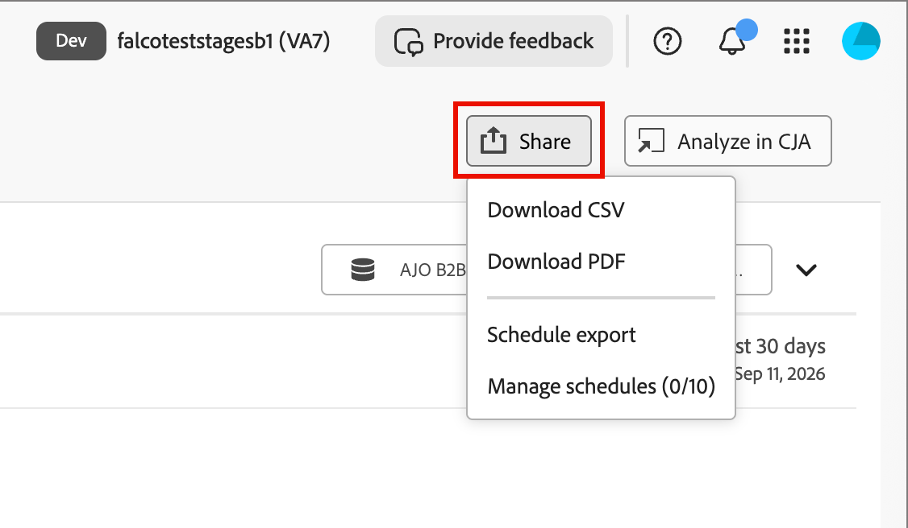

# Berichte

Die Registerkarte [!UICONTROL Berichte] bietet Leistungseinblicke in [!DNL Adobe Marketo Optimizer], einschließlich Journey-Interaktion, E-Mail-Leistung und Web-Aktivität. Wählen Sie in der linken Navigation die Option **[!UICONTROL Berichte]** aus, um sie zu öffnen.

Jeder Bericht basiert auf [!DNL Adobe Customer Journey Analytics] und ist direkt in [!DNL Marketo Optimizer] eingebettet. Klicken Sie auf _list_-Symbol (  ), um das Bedienfeld **[!UICONTROL Inhaltsverzeichnis]** auf der linken Seite zu verwenden, um zwischen Abschnitten zu wechseln.

{width="800" zoomable="yes"}

## Berichtsabschnitte {#report-sections}

Auf [!UICONTROL  Registerkarte ]Berichte“ werden vordefinierte Berichte in vier Abschnitte unterteilt. Jeder Abschnitt enthält ein oder mehrere herunterladbare Elemente und eine eigene Dokumentationsseite mit Details zu den zugehörigen Metriken und Visualisierungen.

| Abschnitt | Herunterladbare Elemente | Berichtseite |
| --- | --- | --- |
| [!UICONTROL Personen-Journey - Übersicht] | Anzahl der aktiven Journeys | [Übersichtsbericht zum Personen-Journey](./person-journey-overview-report.md) |
| [!UICONTROL Interaktion] | Interaktion von Personen, Interaktion von Personen im Zeitverlauf | [Interaktionsbericht](./engagement-report.md) |
| [!UICONTROL E-Mail-Interaktion] | E-Mail-Interaktion | [E-Mail-Interaktionsbericht](./email-engagement-report.md) |
| [!UICONTROL Web-Interaktion] | Top-Seitenansichten | [Web-Interaktionsbericht](./web-engagement-report.md) |

## Individuelle Datensatzberichte {#individual-record-reports}

Einige Berichte konzentrieren sich auf einen einzelnen Datensatz anstelle einer abschnittsweiten Ansicht und der Zugriff erfolgt in einem anderen Bereich der Anwendung.

* Um die Leistung der Optimierung des E-Mail-Versands zu optimieren, öffnen Sie den Bericht über die Chat[!UICONTROL Oberfläche &quot;]&quot;. Anweisungen hierzu finden Sie [E-Mail-Sendezeitoptimierung](../marketing/email-send-time-optimization.md#reporting).
* Den Fortschritt einer Person auf einer einzigen Journey verfolgen, indem Sie den Bericht von dieser Journey aus öffnen.

## Exportieren eines Berichts {#export-a-report}

Wählen **[!UICONTROL oben auf]** Berichtsseite die Option „Freigeben“ aus, um die Daten zu exportieren oder ihren Versand zu planen.

{width="500"}

* **[!UICONTROL CSV herunterladen]** - Exportieren Sie die Berichtsdaten als Nur-Text-Werte.

* **[!UICONTROL PDF herunterladen]** - Exportieren Sie alle im Bericht sichtbaren Tabellen und Visualisierungen als PDF-Datei.

* **[!UICONTROL Export planen]** - Richten Sie einen wiederkehrenden Export des Berichts ein, der wöchentlich oder monatlich als CSV- oder PDF-Datei bereitgestellt wird.

* **[!UICONTROL Zeitpläne verwalten]** - Überprüfen und verwalten Sie vorhandene geplante Exporte. Die Option zeigt eine laufende Anzahl, wie z. B. `3/10`, von Zeitplänen an, die für das Limit Ihres Unternehmens verwendet werden.

>[!NOTE]
>
>Ihr Unternehmen kann wöchentlich oder monatlich maximal 10 geplante Exporte für alle Berichte haben. Wenn Sie kein Administrator sind, können Sie nur Ihre eigenen geplanten Exporte verwalten. Administratoren können jeden geplanten Export in der Organisation anzeigen und verwalten.

## Analysieren eines Berichts in [!DNL Customer Journey Analytics] {#analyze-a-report-in-cja}

>[!AVAILABILITY]
>
>Diese Funktion ist verfügbar, wenn Ihre Organisation für [!DNL Adobe Customer Journey Analytics] lizenziert ist und Ihnen das Produktprofil zugewiesen ist.

Wählen Sie **[!UICONTROL Analysieren in CJA]** in einem Berichtsabschnitt aus, um ihn in [!DNL Adobe Customer Journey Analytics] Workspace zu öffnen, wo Sie zusätzlich zu den im eingebetteten Bericht verfügbaren Visualisierungen benutzerdefinierte Visualisierungen erstellen können.

## Ändern des Datumsbereichs {#change-the-date-range}

Jeder Berichtsabschnitt zeigt Daten für einen bestimmten Datumsbereich an, die in der oberen rechten Ecke des Abschnitts angezeigt werden. Klicken Sie in die Datumsbereichsfelder, um die Datumsauswahl-Werkzeuge anzuzeigen und den Datumsbereich auszuwählen. Sie können eine andere Vorgabe auswählen oder einen benutzerdefinierten Bereich definieren.

{width="600"}
