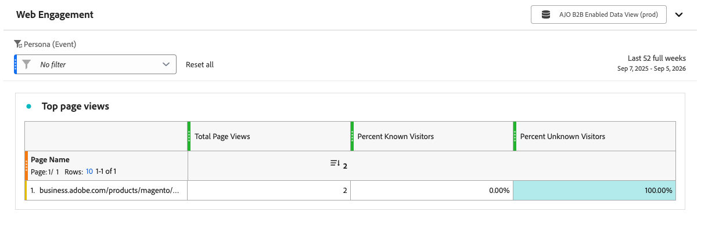

# Web-Interaktionsbericht

<!-- SPHR-39571: Audience, Company Name, Company Industry, and Region filters, plus the report title/subtitle rename, are planned under SPHR-32471 (not yet shipped) and should be documented separately once delivered  -->

Verwenden Sie den [!UICONTROL Web-Interaktion]-Bericht, um die Interaktion mit den wichtigsten interaktiven Webinaren in Ihrer Instanz zu überprüfen.

_Bericht anzeigen :_

1. Wählen Sie in der linken Navigationsleiste die Option **[!UICONTROL Berichte]**.
1. Klicken Sie auf _list_-Symbol (  ) und wählen Sie **[!UICONTROL Web-]** im Bedienfeld _[!UICONTROL Inhaltsverzeichnis]_ aus.

{width="700" zoomable="yes"}

Sie können [&#x200B; Datumsbereich für &#x200B;](./reports-overview.md#change-the-date-range) Bericht ändern.

Wählen **[!UICONTROL oben]** Bericht die Option „Freigeben“ aus, um den Export aller Berichtsdaten herunterzuladen oder zu planen. Siehe [_Exportieren eines Berichts_](./reports-overview.md#export-a-report) in der Übersicht über Berichte.

## Berichtstabelle {#report-table}

Der [!UICONTROL Web-Interaktion]-Bericht zeigt die zehn am häufigsten angezeigten Seiten in Ihrer Instanz mit der folgenden Zeilendimension an.

* **[!UICONTROL Seitenname]** - Der Name der Webseite.

| Spalte | Beschreibung |
| --- | --- |
| [!UICONTROL Seitenansichten insgesamt] | Gesamtzahl der Ansichten für die Seite. |
| [!UICONTROL Prozent bekannte Besucher] | Prozentsatz der Ansichten bekannter Besucher. |
| [!UICONTROL Prozentsatz der unbekannten Besucher] | Prozentsatz der Ansichten unbekannter Besucher. |

## Filter {#filters}

Verwenden Sie den folgenden Filter, um den Bericht auf eine bestimmte Rolle einzugrenzen.

* **[!UICONTROL Persona]** - Filtern Sie nach der Persona, die mit den Seitenansichten verknüpft ist.

>[!NOTE]
>
>Filter für Zielgruppe, Firmenname, Unternehmensbranche und Region sind für eine zukünftige Version geplant.
