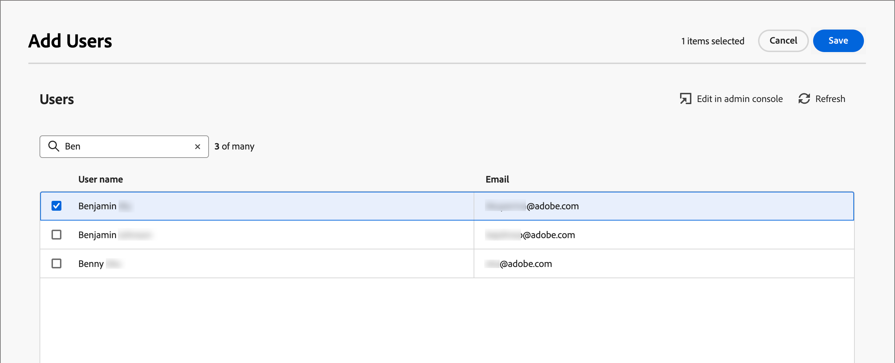

# Benutzerzugriff und Berechtigungen

Nachdem die Bereitstellung abgeschlossen und Sandboxes gebunden sind, führen Sie die folgenden Schritte aus, um Ihrem Team und Ihren Benutzern [!DNL Marketo Optimizer] Zugriff zu gewähren.

1. [Erstellen eines  [!DNL Marketo Optimizer] -Produktprofils](#create-profile) in der Admin Console (nur einmalige/Ersteinrichtung).
1. [Hinzufügen einer Benutzergruppe](#add-user-group) in der Admin Console.
1. [Zuweisen des Produktprofils](#assign-profile) zur Benutzergruppe in der Admin Console.
1. [Benutzer zur neuen Gruppe hinzufügen](#add-users) in der Admin Console.
1. [Bearbeiten von integrierten Rollen](#edit-role-permissions) oder [Erstellen einer benutzerdefinierten Rolle](#create-a-custom-role) mit Produktberechtigungen und der erforderlichen [!DNL Marketo Optimizer]-Sandbox in Experience Platform.
1. [Hinzufügen von ](#add-users-to-a-role) oder [Gruppen](#add-user-groups-to-a-role) zu Rollen in Adobe Experience Platform.

## Produktprofil konfigurieren {#config-profile}

Als Administrator können Sie diese Aufgaben im [!DNL Adobe Admin Console] ausführen. Dies ist ein zentraler Ort, um Ihre Adobe-Produktlizenzen und Benutzende zu verwalten. In der Admin Console können Sie Benutzende an einem zentralen Ort anstatt in Ihren individuellen Lösungen erstellen und verwalten. Weitere Informationen zu den Funktionen und Leistungsmerkmalen von finden Sie auf der Seite Übersicht über Admin Console .

### Die Admin Console aufrufen {#admin-console}

Bevor Sie die Admin Console zum Verwalten von Benutzenden in Ihrem Team verwenden können, müssen Sie sicherstellen, dass Sie auf die Admin Console zugreifen können und über die entsprechenden Berechtigungen verfügen.

1. Als System-Admin sollten Sie im Rahmen des Onboarding-Prozesses mehrere E-Mails von Adobe erhalten.

   Suchen Sie die Begrüßungs-E-Mail mit Informationen zum Namen der Organisation, auf die Sie Zugriff erhalten haben.

1. Klicken Sie auf **[!UICONTROL Link]** Erste Schritte“ in Ihrer Begrüßungs-E-Mail, um zur Admin Console zu navigieren.

   Wenn Sie die E-Mail nicht finden können, öffnen Sie einen Browser unter [https://adminconsole.adobe.com](https://adminconsole.adobe.com) direkt zur Admin Console.

1. Melden Sie sich mit Ihrer Adobe ID an.

   Nach erfolgreicher Anmeldung sehen Sie die _Übersicht_ der Adobe Admin Console.

1. Wenn Sie Zugriff auf mehrere Organisationen haben, stellen Sie sicher, dass Sie sich bei der richtigen Organisation angemeldet haben.

   Um Ihre Organisation zu ändern, klicken Sie oben rechts auf den Organisationsnamen und wählen Sie die Organisation aus, auf die Sie Zugriff benötigen.

1. Wählen Sie **[!UICONTROL Administratoren]** auf der Karte _[!UICONTROL Benutzer]_ aus, um zu überprüfen, ob Sie ein Systemadministrator sind.

   {width="800" zoomable="yes"}

1. Suchen Sie durch Eingabe Ihrer Adobe ID-E-Mail-Adresse, Ihres Benutzernamens, Vor- oder Nachnamens.

   * Wenn Ihr Zugriff richtig konfiguriert ist, gibt die Suche Ihren Eintrag zurück.

   * Wenn in der Spalte **[!UICONTROL ADMINISTRATORROLLE]** der Wert &quot;`System`&quot; angezeigt wird, bedeutet dies, dass Sie (oder die angezeigte Person) System-Admin sind.

### [!DNL Marketo Optimizer] Produktprofil erstellen {#create-profile}

Wenn Sie Benutzenden Zugriff auf eine Adobe-Lösung gewähren, möchten Sie ihnen nicht unbedingt uneingeschränkten Zugriff gewähren. Produktprofile ermöglichen es jeder Lösung, über eigene Benutzerberechtigungen zu verfügen. Verwenden Sie die Admin Console, um Produktprofile zuzuweisen.

Weitere Informationen zur Verwendung von Produktprofilen für Benutzerberechtigungen finden Sie unter [_Verwalten von Produktprofilen für Unternehmensbenutzer_](https://helpx.adobe.com/business/enterprise/products-entitlements/manage-product-profiles/product-profiles.html){target="_blank"} in der Dokumentation zu Admin Console.

{width="30"} Ein Systemadministrator oder [!DNL Experience Platform] Produktadministrator kann die folgenden Schritte unter [https://adminconsole.adobe.com](https://adminconsole.adobe.com) ausführen.

1. Wählen Sie die Registerkarte **[!UICONTROL Produkte]** aus.

1. Öffnen Sie die [!DNL Marketo Optimizer]-Instanz, der Sie das Profil hinzufügen möchten, und klicken Sie auf **[!UICONTROL Neues Profil]**.

1. Geben Sie einen Produktprofilnamen ein, z. B. _Zugriff_.

1. Klicken Sie **[!UICONTROL Weiter]** und dann **[!UICONTROL Speichern]**.

### Hinzufügen einer Benutzergruppe {#add-user-group}

Eine Benutzergruppe ist eine Sammlung von Benutzern, denen ein gemeinsamer Berechtigungssatz gewährt wird. Sie können Benutzer in Ihrer Benutzergruppe hinzufügen oder entfernen. Die Gruppenberechtigungen bleiben unverändert, während die Benutzer innerhalb der Gruppe wechseln.

Weitere Informationen dazu, wie Benutzergruppen zum Verwalten von Berechtigungen verwendet werden, finden Sie unter [Verwalten von Benutzergruppen](https://helpx.adobe.com/business/enterprise/users/users-and-groups/user-groups.html){target="_blank"} in der Dokumentation zu Admin Console.

{width="30"} Ein Systemadministrator kann die folgenden Schritte unter [https://adminconsole.adobe.com](https://adminconsole.adobe.com) ausführen.

1. Wählen Sie die **[!UICONTROL Benutzer]** aus.

1. Wählen **[!UICONTROL Benutzergruppen]** im linken Navigationsbereich aus.

1. Klicken **[!UICONTROL oben]** auf „Neue Benutzergruppe“.

1. Geben Sie einen Namen für die Benutzergruppe ein, z. B. _Optimizer-Benutzer_ und klicken Sie auf **[!UICONTROL Speichern]**.

   {width="600" zoomable="yes"}

### Produktprofil zuweisen {#assign-profile}

{width="30"} Ein Produktadministrator kann die folgenden Schritte unter [https://adminconsole.adobe.com](https://adminconsole.adobe.com) ausführen.

1. Klicken Sie auf die von Ihnen erstellte Benutzergruppe.

1. Wählen Sie die Registerkarte **[!UICONTROL Zugewiesene Produktprofile]** und klicken Sie auf **[!UICONTROL Profil zuweisen]**.

1. Klicken Sie auf **+** und fügen Sie jede Instanz der folgenden Produkte hinzu:

   * [!UICONTROL Adobe Marketo Optimizer - Zugriff]
   * [!UICONTROL Adobe Experience Platform - AEP-default-all-users]
   * [!UICONTROL Adobe Experience Platform-Datenerfassung - Standardzugriff auf die Datenerfassung für alle]
   * [!UICONTROL Adobe Experience Platform - Standardzugriff auf alle Produktionsumgebungen]

   {width="600" zoomable="yes"}

1. Klicken Sie auf **[!UICONTROL Speichern]**.

### Benutzer zur neuen Gruppe hinzufügen {#add-users}

Informationen zur Benutzerverwaltung finden Sie unter [_Adobe Admin Console-Benutzer_](https://helpx.adobe.com/business/enterprise/users/understand-user-management/user-management-overview.html){target="_blank"} in der Dokumentation zu Admin Console.

{width="30"} Ein System- oder Produktadministrator kann die folgenden Schritte unter [https://adminconsole.adobe.com](https://adminconsole.adobe.com) ausführen. Ein Produktadministrator kann nur Benutzer hinzufügen, die bereits in seiner Organisation vorhanden sind.

1. Wenn die Benutzer noch nicht Mitglieder Ihrer Organisation sind, fügen Sie jeden Benutzer hinzu:

   * Klicken _[!UICONTROL unter &quot;]_&quot; auf **[!UICONTROL Benutzer hinzufügen]**.

   * Geben Sie die E-Mail-Adresse des Benutzers ein und klicken Sie auf **[!UICONTROL Als neuen Benutzer hinzufügen]**.

     {width="600" zoomable="yes"}

   * Geben Sie den Vor- und Nachnamen ein und klicken Sie dann auf **[!UICONTROL Speichern]**.

1. Fügen Sie jeder Benutzer der Gruppe hinzu:

   * Klicken Sie auf den Benutzernamen.

   * Scrollen Sie auf der Seite mit den Benutzerdetails zu **[!UICONTROL Benutzergruppen]**.

   * Klicken Sie links auf _Mehr_ ( **…** ) und wählen Sie **[!UICONTROL Benutzergruppen bearbeiten]**.

   * Klicken Sie auf _Hinzufügen_ ( **+** ) unter **[!UICONTROL Benutzergruppen]**.

     {width="600" zoomable="yes"}

   * Wählen Sie die zuvor erstellte Benutzergruppe aus und klicken Sie auf **[!UICONTROL Anwenden]**.

   * Klicken **[!UICONTROL auf &quot;]**&quot; für die Benutzeränderungen.

## Zuweisen von Produktberechtigungen {#assign-product-permissions}

Berechtigungen sind Einzelrechte, mit denen Sie die einem Produktprofil zugewiesenen Berechtigungen definieren können. Jede Berechtigung wird unter einer Funktion gruppiert, z. B. Journey oder Inhalte von Personen, die Funktionen in [!DNL Marketo Optimizer] darstellen.

Im _Berechtigungen_ von Adobe Experience Platform können Admins Benutzerrollen und Zugriffsrichtlinien definieren, um Zugriffsberechtigungen für Funktionen und Objekte innerhalb einer Produktanwendung zu verwalten. In dieser App können Sie Rollen erstellen und verwalten sowie die gewünschten Ressourcenberechtigungen für diese Rollen zuweisen. Mit Berechtigungen können Sie auch die Sandboxes und die Benutzer verwalten, die einer bestimmten Rolle zugeordnet sind.

Weitere Informationen zu Rollenberechtigungen in Experience Platform finden Sie unter [Verwalten von Berechtigungen für eine Rolle](https://experienceleague.adobe.com/en/docs/experience-platform/access-control/abac/permissions-ui/permissions){target="_blank"} in der Dokumentation zu Experience Platform.

1. Navigieren Sie zu [experience.adobe.com](https://experience.adobe.com/).

1. Wählen Sie im Bedienfeld _[!UICONTROL Schnellzugriff]_ die Option **[!UICONTROL Berechtigungen]** aus.

   >[!NOTE]
   >
   >Wenn „Berechtigungen _[!UICONTROL nicht angezeigt wird]_ müssen Sie möglicherweise auf **[!UICONTROL Alle anzeigen]** klicken und diese aus den verfügbaren Programmen auswählen.

   {width="700" zoomable="yes"}

### Ressourcen zu Berechtigungen {#permissions}

Die folgenden Berechtigungsressourcen steuern den Zugriff auf die Funktionen für Kanalkonfiguration, Content-Management und Personen-Journey in [!DNL Marketo Optimizer]:

>[!IMPORTANT]
>
>[!DNL Marketo Optimizer] Zugriff erfordert, dass Sie eine bestimmte Sandbox aktivieren, die mithilfe der folgenden Namenskonvention bereitgestellt wird: `Mktoaep` + [!DNL Marketo Engage] Abonnementpräfix. Wenn Ihr verknüpftes [!DNL Marketo Engage]-Abonnementpräfix beispielsweise _AcmeAssoc_ lautet, ist die für den [!DNL Marketo Optimizer] erforderliche Sandbox _MktoaepAcmeAssoc_.

| Kategorie | Berechtigung | Beschreibung |
| -------- | ----------- | ---------- |
| B2B-Kanal-Konfigurationen | B2B-E-Mail-Einstellungen anzeigen | E-Mail-Einstellungen anzeigen (Subdomains, PTR-Einträge, IP-Pools, Unterdrückungslisten, Seed-Listen, IP-Aufwärmpläne). |
| | B2B-E-Mail-Einstellungen verwalten | Konfigurieren Sie E-Mail-Einstellungen (Subdomains, PTR-Einträge, IP-Pools, Unterdrückungslisten, Seed-Listen, IP-Aufwärmpläne). Diese Einstellungen sind erforderlich, damit Benutzer E-Mails senden können. |
| | Verwalten von B2B-Kanalkonfigurationen | Zugriff auf den _Kanäle_ im linken Navigationsbereich und alle Kanalkonfigurationsvorgänge. |
| | Verwalten von B2B-WhatsApp-Voreinstellungen | Erstellen, Anzeigen und Löschen von WhatsApp-Nachrichtenvoreinstellungen und zugehörigen SMS-Einstellungen. |
| B2B-Journey | Verwalten von B2B-Personen-Journey | Zugriff auf die _Personen-Journey_-Liste und alle Personen-Journey-Vorgänge. |
| B2B-Assets | Anzeigen von Inhaltsvorlagen | Anzeigen der Liste der Inhaltsvorlagen und Details. |
| | B2B-Vorlagen verwalten | Erstellen, Bearbeiten und Löschen von Inhaltsvorlagen. |
| | Anzeigen von B2B-Fragmenten | Anzeigen der Liste und Details von Inhaltsfragmenten. |
| | Verwalten von B2B-Fragmenten | Erstellen, Bearbeiten und Löschen von Inhaltsfragmenten. |
| | Veröffentlichen von B2B-Fragmenten | Veröffentlichen Sie Inhaltsfragmente zur Verwendung in Vorlagen, E-Mails und Landingpages. |
| | B2B-Assets anzeigen | Zeigen Sie Details zur Assets-Bibliothek und Asset-Datei an. |
| | Verwalten von B2B-Assets | Erstellen, Bearbeiten und Löschen von Asset-Dateien. |
| | B2B-E-Mails anzeigen | E-Mail-Nachrichten anzeigen. |
| | Verwalten von B2B-E-Mails | Erstellen, Bearbeiten und Löschen von E-Mail-Nachrichten. |
| | Export von B2B-Nachrichten verwalten | Exportieren Sie Nachrichtenberichte unter dem Abschnitt E-Mail . |
| Journey Optimizer-Bibliothek | Verwalten von B2B-Bibliothekselementen | Hinzufügen und Löschen gespeicherter Ausdrücke in der Bibliothek. |
| Data Governance | Verwalten von B2B-Löschkennzeichnungen | Anzeigen, Erstellen und Löschen von Datennutzungskennzeichnungen (Data Usage Labels, DULE), die auf Datensätze und Schemata angewendet werden. |
| Sandbox-Verwaltung | Verwalten von B2B-Paketen | Erstellen, exportieren, importieren, kopieren und löschen Sie Sandbox-Pakete. |

Um Unterstützung für externe Ziele in [!DNL Marketo Optimizer] bereitzustellen, sind die folgenden Berechtigungen erforderlich:

| Kategorie | Berechtigung | Beschreibung |
| -------- | ----------- | ---------- |
| Dashboards | Standard-Dashboards anzeigen | Schreibgeschützter Zugriff auf die Dashboards _Profile_, _Ziele_ und _Segmente_. Ermöglicht auch den Zugriff auf _Dashboards_ im linken Navigationsbereich und auf die Registerkarte _Dashboards_ Inventar und Integrationen . |
| | Standard-Dashboards verwalten | Fügen Sie benutzerdefinierte Attribute hinzu, die sich noch nicht im Data Warehouse befinden. |
| Ziele | Anzeigen von Zielen | Schreibgeschützter Zugriff zum Anzeigen verfügbarer Ziele auf der Registerkarte _Katalog_ und authentifizierter Ziele auf der Registerkarte _Durchsuchen_. |
| | Verwalten von Zielen | Anzeigen, Erstellen und Löschen von Zielverbindungen und Zielkonten. |
| | Aktivieren von Zielen | Aktivieren von Daten für aktive Ziele. Entweder _Ziele anzeigen_ oder _Ziele verwalten_ ist auch erforderlich, um auf diese Funktion zuzugreifen. |
| | Segment ohne Zuordnung aktivieren | Aktivieren Sie Zielgruppen für vorhandene Ziele, ohne den Zuordnungsschritt anzuzeigen. Benutzende können Zielgruppen zu Aktivierungs-Workflows hinzufügen und welche daraus entfernen, jedoch keine zugeordneten Attribute oder Identitäten. Die _Ziele anzeigen_-Berechtigung ist auch erforderlich, um auf diese Funktion zuzugreifen. |
| | Verwalten und Aktivieren des Datensatzziels | Datensatz-Exportflüsse anzeigen, erstellen, bearbeiten und deaktivieren sowie Daten für aktive Datensätze aktivieren. Die _Ziele anzeigen_-Berechtigung ist auch erforderlich, um auf diese Funktion zuzugreifen. |
| | Ziel-Authoring | Möglichkeit, Ziele mithilfe der Adobe Experience Platform Destination SDK zu erstellen. |
| Data Governance | Anzeigen von Datennutzungsrichtlinien | Schreibgeschützter Zugriff auf Datennutzungsrichtlinien Ihrer Organisation. |
| | Verwalten von Datennutzungsrichtlinien | Anzeigen, Erstellen, Bearbeiten und Löschen von Datennutzungsrichtlinien. |
| Datenaufnahme | Anzeigen von Quellen | Schreibgeschützter Zugriff auf verfügbare Quellen auf der Registerkarte _Katalog_ und authentifizierte Quellen auf der Registerkarte _Durchsuchen_. |
| | Verwalten von Quellen | Anzeigen, Erstellen, Bearbeiten und Deaktivieren von Quellen. |
| Profilverwaltung | Profileinstellungen anzeigen | Schreibgeschützter Zugriff auf alle Profileinstellungen. |
| | Profileinstellungen verwalten | Alle Profileinstellungen anzeigen und bearbeiten. |

<!--

### B2B built-in roles {#b2b-built-in-roles}

When your organization has [!DNL Marketo Optimizer] provisioned, Experience Platform includes a set of built-in (default, read-only) roles that you can use to manage access to the product capabilities:

| Role | Permissions |
| ---- | ----------- |
| B2B Journey Manager | <li>Manage B2B Journeys <li>Manage B2B Buying Groups <li>Manage B2B Account Lists <li>View B2B Engagement Dashboard <li>View B2B Insights Dashboard |
| B2B Channel Manager | <li>Manage B2B Assets <li>Manage B2B Templates <li>Manage B2B Fragments |
| B2B System Administrator | <li>Manage B2B Channels Configurations <li>Manage B2B Admin Configurations |

-->

### Rollenberechtigungen bearbeiten {#edit-role-permissions}

Für integrierte oder benutzerdefinierte Rollen können Sie sich jederzeit entscheiden, Berechtigungen hinzuzufügen oder zu löschen. Wenn Sie eine standardmäßige oder benutzerdefinierte Rolle ändern, wirkt sich dies auf jeden Benutzer aus, der dieser Rolle zugewiesen ist.

>[!IMPORTANT]
>
>[!DNL Marketo Optimizer] Zugriff erfordert, dass Sie eine bestimmte Sandbox aktivieren, die mithilfe der folgenden Namenskonvention bereitgestellt wird: `Mktoaep` + [!DNL Marketo Engage] Abonnementpräfix. Wenn Ihr verknüpftes [!DNL Marketo Engage]-Abonnementpräfix beispielsweise _AcmeAssoc_ lautet, ist die für den [!DNL Marketo Optimizer] erforderliche Sandbox _MktoaepAcmeAssoc_.

>[!NOTE]
>
>Ein Produktadministrator mit Zugriff auf Experience Platform-Berechtigungen kann die folgenden Schritte ausführen.

_So ändern Sie die Berechtigungen für eine Rolle :_

1. Wählen **[!UICONTROL Rollen]** im linken Navigationsbereich aus.

1. Klicken Sie auf **_Rollennamen_** Optimizer-Benutzer“.

1. Klicken Sie auf der Detailseite oben **[!UICONTROL auf]** Bearbeiten“.

   {width="800" zoomable="yes"}

   Im Rolleneditor wird im Menü _[!UICONTROL Ressourcen]_ die Liste der Ressourcen angezeigt, die für die von Experience Cloud unterstützten Programme gelten.

1. Sandbox auswählen, die für [!DNL Marketo Optimizer] Zugriff bereitgestellt wurde (`Mktoaep<Marketo subscription prefix>`).

   {width="500" zoomable="yes"}

1. Klicken Sie auf _Hinzufügen_-Symbol (**+**) für jede der funktionalen Ressourcen.

   {width="700" zoomable="yes"}

1. Fügen Sie die spezifischen Berechtigungen für jede der Ressourcen hinzu oder wählen Sie **[!UICONTROL Alle hinzufügen]** aus.

1. Klicken Sie auf **[!UICONTROL Speichern]**.

   <!-- {width="700" zoomable="yes"} -->

1. Klicken Sie **[!UICONTROL Schließen]**, um zur Detailseite zurückzukehren.

### Benutzer zu einer Rolle hinzufügen {#add-users-to-a-role}

{width="30"} Ein Systemadministrator oder Experience Platform-Administrator kann die folgenden Schritte ausführen.

1. Öffnen Sie die Rollendetails und wählen Sie die Registerkarte **[!UICONTROL Benutzer]** aus.

   Auf dieser Registerkarte wird eine Liste aller Benutzer angezeigt, die der Rolle zugewiesen wurden.

1. Klicken Sie **[!UICONTROL Benutzer hinzufügen]**.

   {width="800" zoomable="yes"}

1. Suchen Sie im _[!UICONTROL Benutzer hinzufügen]_ die Benutzer, die Sie der Rolle hinzufügen möchten, und wählen Sie sie aus.

   * Sie können das Suchwerkzeug verwenden, um die Benutzerliste zu filtern.

   * Wählen Sie das Kontrollkästchen für jede Person aus.

   {width="600" zoomable="yes"}

1. Klicken Sie **[!UICONTROL Speichern]**, wenn Sie alle Benutzenden ausgewählt haben, die Sie hinzufügen möchten.

### Hinzufügen von Benutzergruppen zu einer Rolle {#add-user-groups-to-a-role}

Informationen zur Benutzerverwaltung finden Sie unter [_Adobe Admin Console-Benutzer_](https://helpx.adobe.com/business/enterprise/users/understand-user-management/user-management-overview.html){target="_blank"} in der Dokumentation zu Admin Console.

{width="30"} Ein Systemadministrator oder Experience Platform-Administrator kann die folgenden Schritte ausführen.

1. Öffnen Sie die Rollendetails und wählen Sie die Registerkarte **[!UICONTROL Benutzergruppen]** aus.

   Auf dieser Registerkarte wird eine Liste aller Benutzergruppen angezeigt, die der Rolle zugewiesen sind.

1. Klicken Sie **[!UICONTROL Gruppen hinzufügen]**.

   {width="800" zoomable="yes"}

1. Suchen Sie im _[!UICONTROL Gruppen hinzufügen]_ die Gruppen, die Sie der Rolle hinzufügen möchten, und wählen Sie sie aus.

   * Sie können das Suchwerkzeug verwenden, um die Liste der Benutzergruppen zu filtern.

   * Aktivieren Sie das Kontrollkästchen für jede Benutzergruppe.

   {width="600" zoomable="yes"}

1. Klicken Sie **[!UICONTROL Speichern]**, wenn Sie alle Gruppen ausgewählt haben, die Sie hinzufügen möchten.

### Erstellen einer benutzerdefinierten Rolle {#create-a-custom-role}

{width="30"} Ein Systemadministrator oder Experience Platform-Administrator kann die folgenden Schritte ausführen.

1. Wählen Sie **[!UICONTROL linken Navigationsbereich die Option]** Rollen“ und dann **[!UICONTROL Rolle erstellen]** aus.

1. Geben _[!UICONTROL im Dialogfeld Neue Rolle erstellen]_ einen Namen für die Rolle ein, z. B. _B2B-Marketer_ und eine Beschreibung (optional).

1. Klicken Sie auf **[!UICONTROL Bestätigen]**.

1. Sandbox auswählen, die für [!DNL Marketo Optimizer] Zugriff bereitgestellt wurde (`Mktoaep<Marketo subscription prefix>`).

   {width="500" zoomable="yes"}

1. Hinzufügen von Produktberechtigungen:

   Informationen dazu, welche Produktfunktionen Sie für die Rolle verwenden möchten, finden Sie in der Liste der [Produktberechtigungen](#permissions).

   Suchen Sie in der _[!UICONTROL Ressourcen]_-Liste auf der linken Seite die B2B-Elemente und klicken Sie auf das _Hinzufügen_-Symbol (**+**), um jedes Attribut hinzuzufügen, das Sie für die Rolle aktivieren möchten.

   Sie können im Suchwerkzeug _B2B_ eingeben, um die Liste nach vielen der B2B-bezogenen Produktberechtigungen zu filtern, die für [!DNL Marketo Optimizer] gelten.

   {width="700" zoomable="yes"}

1. Klicken **[!UICONTROL oben]** auf „Speichern“.

1. Gehen Sie zu den Rollendetails und wählen Sie die Registerkarte **[!UICONTROL Benutzergruppen]** aus.

1. Klicken Sie **[!UICONTROL Gruppen hinzufügen]**.

1. Aktivieren Sie das Kontrollkästchen neben der Benutzergruppe, die Sie zuvor in der Admin Console erstellt haben.

1. Klicken Sie auf **[!UICONTROL Speichern]**.

Ihre benutzerdefinierte Rolle ist konfiguriert und Benutzerinnen und Benutzer in der zugewiesenen Gruppe können jetzt auf die ausgewählten [!DNL Marketo Optimizer] zugreifen.
